# LIME Settings iOS App — Specification

## 1. Overview

This document specifies the design and behaviour of the **LimeIME container app** (the Settings app the user sees in the iOS Home Screen, not the keyboard extension). The goal is to replicate **every feature of the Android LIME Settings app** while applying iOS HIG conventions: `NavigationStack` / `NavigationView` for drill-down navigation, `Form + Section` for preference settings, `List` with swipe actions for record management, `Picker` for single-choice selections, and `Toggle` for boolean controls.

The app is organized around **four high-level feature areas**:

| Feature | Purpose |
|---|---|
| **IM Manager** | Install, download, import/export, and configure soft keyboard layouts |
| **IM Table Editor** | Browse and edit per-IM character mapping records and related phrases |
| **DB Manager** | Backup and restore the entire database |
| **IM Preferences** | Tune all keyboard behaviour and display settings |

A fifth area — **App Setup** — handles one-time activation and app-level information (version, about).

### Android → iOS Component Mapping

| Android component | iOS Feature Area | Tab |
|---|---|---|
| `SetupImFragment` (activation guide) | App Setup | 設定 |
| `SetupImFragment` (IM buttons) | IM Manager — enable/disable | 輸入法 |
| `kbsetting.xml` (IM info + keyboard picker) | IM Manager — keyboard config | 輸入法 drill-down |
| `IMStoreView` / cloud download | IM Manager — download | 輸入法 |
| `SetupImFragment` (import file) | IM Manager — import | 輸入法 |
| `ManageImFragment` (record CRUD) | IM Table Editor — mapping records | 輸入法 drill-down |
| `ManageRelatedFragment` | IM Table Editor — related phrases | 輸入法 (drill-down via 關聯字庫) |
| `SetupImFragment` (backup/restore) | DB Manager | 資料庫 |
| `LIMEPreference` (`preference.xml`) | IM Preferences | 喜好設定 |

---

## 2. App Structure

The container app uses a `TabView` with **four tabs**. This collapses the Android navigation drawer + separate Preference activity into a flat tab bar per iOS HIG. Related-phrase editing (formerly a standalone tab) is now accessed via the 關聯字庫 entry inside the 輸入法 tab.

```
TabView
├── [0] 設定       systemImage: "gearshape"          (App Setup)
├── [1] 輸入法      systemImage: "list.bullet"         (IM Manager + IM Table Editor + 關聯字庫)
├── [3] 喜好設定    systemImage: "slider.horizontal.3" (IM Preferences)
└── [4] 資料庫      systemImage: "archivebox"          (DB Manager)
```

Each tab has its own `NavigationStack` (iOS 16+) or `NavigationView` (iOS 15) so drill-down navigation stays scoped to its tab.

---

## 3. MVC Architecture Mandate

The iOS LIME Settings app **strictly follows the same MVC pattern** defined in [UI_ARCHITECTURE.md](UI_ARCHITECTURE.md). This is a hard architectural constraint, not a guideline.

### 3.1 Layer Compliance Rules

| Layer | Android | iOS | Porting Target |
|---|---|---|---|
| **Model** | `SearchServer`, `DBServer`, `LimeDB`, `LIMEPreferenceManager` | Same names, Swift | **100% — identical operations, logic, error handling, threading** |
| **Controller / Manager** | `SetupImController`, `ManageImController`, `NavigationManager`, `ShareManager`, `ProgressManager`, `IntentHandler` | Same names, Swift | **100% — identical orchestration, data flow, callback interfaces** |
| **View** | `MainActivity`, Fragments, Dialogs, `LIMEPreference` Activity | SwiftUI Views, Sheets, `TabView` | **Adapted to iOS HIG only — SwiftUI replaces XML/Fragment, everything else identical** |

### 3.2 Model Layer (100% Port)

The Model layer is ported to Swift with **no behavioural divergence** from the Android source. Every public method, return contract, null-safety rule, and threading assumption must be reproduced exactly.

| Android Class | iOS Swift Class | Purpose |
|---|---|---|
| `SearchServer` | `SearchServer.swift` | DB query operations, record search, keyboard config, related phrase queries |
| `DBServer` | `DBServer.swift` | File-level DB operations — import, export, backup, restore, table ops |
| `LimeDB` | `LimeDB.swift` | SQL abstraction — query execution, schema management, serialization |
| `LIMEPreferenceManager` | `LIMEPreferenceManager.swift` | Preferences persistence, query, defaults — reads/writes the shared App Group suite |

**Model layer rules** (mirroring `UI_ARCHITECTURE.md §Layer 3`):
- No UIKit / SwiftUI framework dependencies (except `FileManager` for file paths).
- No direct reference to any View type.
- Return safe defaults instead of `nil` (empty arrays, zero counts).
- All exceptions caught at this layer; callers receive `Result<T, Error>` or a safe default.

### 3.3 Controller / Handler / Manager Layer (100% Port)

Business logic and operation orchestration are ported to Swift **without changing the operation sequence or callback contract**. The data flow diagrams in `UI_ARCHITECTURE.md §Data Flow` define the exact call order that must be reproduced.

| Android Class | iOS Swift Class | Responsibilities |
|---|---|---|
| `BaseController` | `BaseController.swift` | `@MainActor` UI dispatch, error handling, progress callbacks — mirrors `mainHandler.post()` with Swift `DispatchQueue.main.async` / `await MainActor.run` |
| `SetupImController` | `SetupImController.swift` | Import workflow (txt / limedb / remote download), backup/restore, IM menu refresh, button state |
| `ManageImController` | `ManageImController.swift` | Async record CRUD, search/filter, keyboard selection, clear / remove IM |
| `ManageRelatedController` | `ManageRelatedController.swift` | Async related-phrase CRUD, search/filter, clear related |
| `NavigationManager` | `NavigationManager.swift` | Tab/screen selection state, navigation callbacks |
| `ShareManager` | `ShareManager.swift` | Export IM / related as `.limedb` or `.lime` text, share-sheet invocation |
| `ProgressManager` | `ProgressManager.swift` | Progress overlay show/update/dismiss — wraps SwiftUI `@Published` state on `@MainActor` |
| `IntentHandler` | `IntentHandler.swift` | Incoming file handling (`.lime`, `.cin`, `.limedb`) from system share / Files |

**Controller layer rules** (mirroring `UI_ARCHITECTURE.md §Layer 2`):
- Controllers receive Model objects via constructor injection — no direct `UserDefaults` or `FileManager` calls except through `DBServer` / `LIMEPreferenceManager`.
- All heavy I/O dispatched on a background `Task` / `DispatchQueue.global`; all View callbacks dispatched on `MainActor`.
- Controllers and Managers hold no UIKit/SwiftUI types — they interact with Views only through **Swift protocols** (see §3.4).

### 3.4 View Protocols (100% Port of Java Interfaces, Swift Syntax)

All Android View interfaces are ported to Swift `protocol` with identical callback signatures.

| Android Interface | Swift Protocol |
|---|---|
| `ViewUpdateListener` | `ViewUpdateListener` |
| `MainActivityView` | `MainActivityView` |
| `SetupImView` | `SetupImView` |
| `ManageImView` | `ManageImView` |
| `ManageRelatedView` | `ManageRelatedView` |
| `NavigationDrawerView` | `NavigationDrawerView` |

```swift
// Direct Swift translation of Android ViewUpdateListener
protocol ViewUpdateListener: AnyObject {
    func onError(_ message: String)
    func onProgress(_ percentage: Int, status: String)
}

protocol SetupImView: ViewUpdateListener {
    func updateButtonStates(_ states: [String: Bool])
    func refreshImList()
}

protocol ManageImView: ViewUpdateListener {
    func displayRecords(_ records: [LimeRecord])
    func updateRecordCount(_ count: Int)
    func refreshRecordList()
}

protocol ManageRelatedView: ViewUpdateListener {
    func displayRelatedPhrases(_ phrases: [Related])
    func refreshPhraseList()
}
```

### 3.5 View Layer (iOS-Adapted Only)

The View layer is the **only layer that deviates** from the Android source. Substitutions are one-to-one structural replacements — the same screens exist, only the platform primitives differ.

| Android View Component | iOS Equivalent | Notes |
|---|---|---|
| `MainActivity` (coordinator) | `LimeSettingsApp` + root `ContentView` | Owns and injects controller/manager instances |
| `NavigationDrawerFragment` | `TabView` (§2) | Same IM navigation items, different platform widget |
| `SetupImFragment` | `SetupTabView` + `IMListView` + `IMInstallView` | Setup guide + IM list + download flows |
| `ManageImFragment` | `RecordListView` + `AddRecordView` + `EditRecordView` | Per-IM record CRUD |
| `ManageRelatedFragment` | `RelatedListView(isEmbedded:)` + `AddRelatedView` + `EditRelatedView` | Related phrase CRUD — embedded in IMDetailView via 關聯字庫 entry |
| `LIMEPreference` Activity + `PrefsFragment` | `PreferencesTabView` with `Form` sections | All 11 preference sections |
| `ImportDialog` / `SetupImLoadDialog` | SwiftUI `.sheet` + `.fileImporter` | File selection and import options |
| `ImDetailFragment.showShareFormatDialog()` | `.confirmationDialog` + `ShareSheet` (`UIActivityViewController`) | IM export/share format selection |
| `ManageImAddDialog` / `ManageImEditDialog` | SwiftUI `.sheet` (`AddRecordView` / `EditRecordView`) | Record add/edit forms |
| `ManageImKeyboardDialog` | `KeyboardPickerView` (Navigation drill-down) | Keyboard layout selection |
| `ProgressDialogManager` overlay | `ProgressManager` `.overlay(ProgressView(...))` | Progress feedback |

**Permitted iOS-View adaptations:**
- Use SwiftUI declarative layout instead of XML inflation.
- Use `NavigationStack` + `TabView` instead of navigation drawer.
- Use `.sheet`, `.alert`, `.confirmationDialog` instead of `AlertDialog` / `DialogFragment`.
- Use `.searchable()` **or** a custom inline search bar (`TextField` + clear button) instead of a manual search `EditText` + button. (The record / related lists in §6 use the inline bar.)
- Use `@StateObject` / `@ObservedObject` for reactive state instead of `notifyDataSetChanged()`.
- Apply iOS HIG spacing, typography, and colour conventions.

**Not permitted in the View layer:**
- Moving any business logic (DB calls, file I/O, state coordination) directly into a SwiftUI `View` struct — all such logic must remain in the Controller / Manager layer.
- Skipping any screen, operation, or callback defined in the Android source.

### 3.6 Testing and Verification Requirements

The **Model and Controller layers must achieve the same testability goals** as the Android architecture (see `UI_ARCHITECTURE.md §Benefits — Testability`).

| Requirement | Rule |
|---|---|
| **Unit tests for all Controllers** | `SetupImControllerTests`, `ManageImControllerTests` — test every public method with mock Model objects |
| **Unit tests for all Model classes** | `SearchServerTests`, `DBServerTests`, `LimeDBTests`, `LIMEPreferenceManagerTests` |
| **No framework dependency in tests** | Controller and Model tests must compile and run without a simulator (XCTest only, no UIKit/SwiftUI) |
| **Mock View protocols** | Each test file provides a `Mock*View` struct implementing the corresponding protocol to capture callbacks |
| **Data flow verification** | Every data flow in `UI_ARCHITECTURE.md §Data Flow` (import, export, backup, restore) must have a corresponding integration test asserting the full call sequence |
| **Threading verification** | Tests assert that View callbacks are always delivered on the main thread |
| **100% operation coverage** | Every Android operation listed in §3.2 and §3.3 must have a corresponding Swift implementation and a passing test |

---

## 4. Feature: App Setup (設定 Tab) 

**Purpose**: One-time keyboard activation guide, database seeding, and app information. Corresponds to the non-IM-management parts of Android's `SetupImFragment`.

| iOS | Android |
|---|---|
| 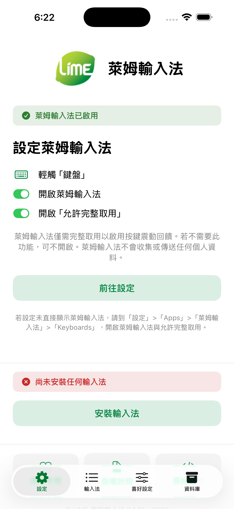 | 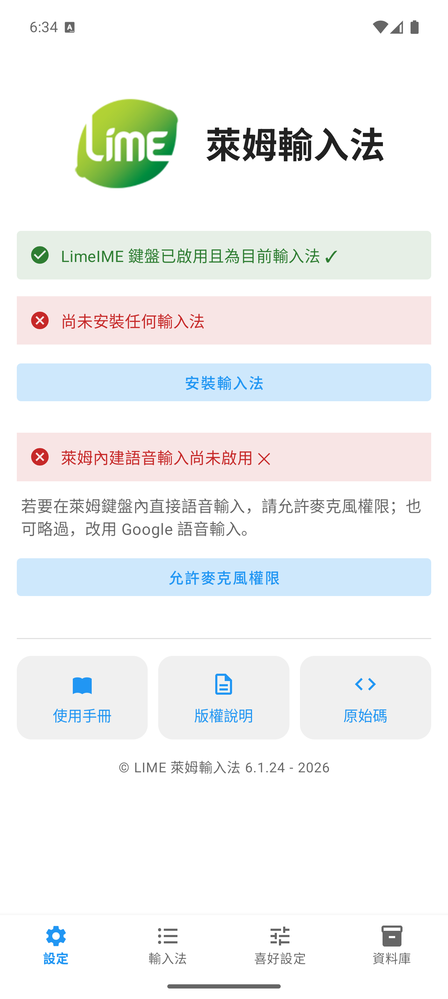 |
| 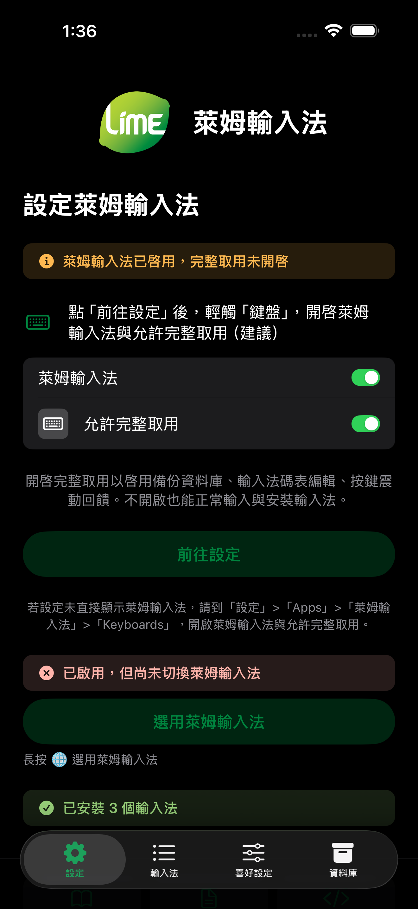 | 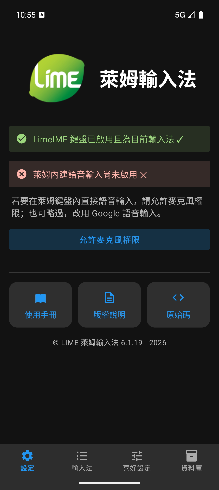 |

| iPad (light) | iPad (dark) |
|---|---|
| 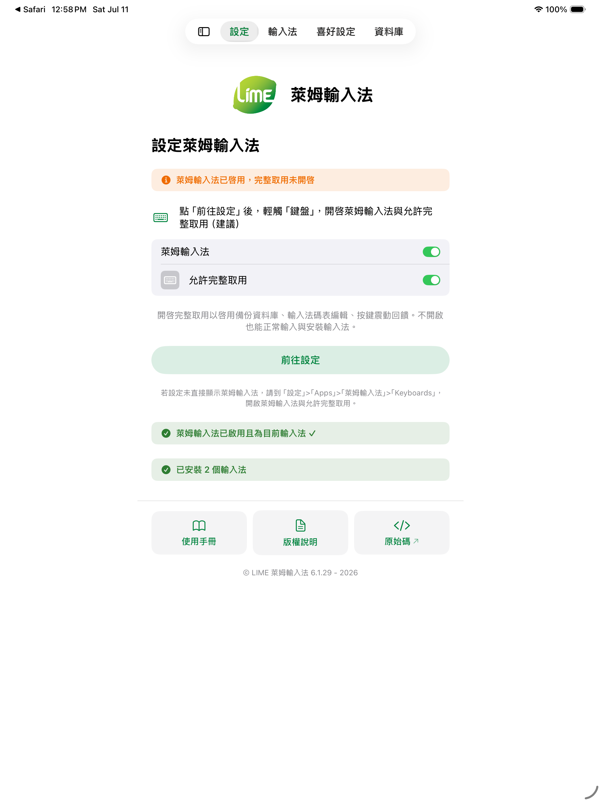 | 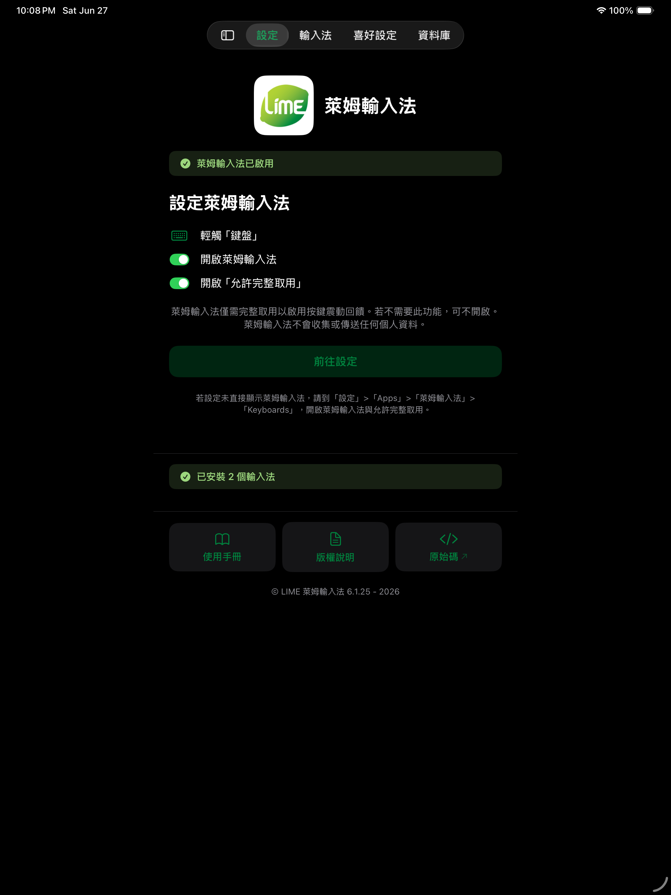 |

### 4.1 Layout

Inspired by Gboard's setup screen: a single scrollable screen with the LimeIME logo at top, a visual three-step instruction list, and **one CTA button** that opens the app's system Settings page. The navigation bar is hidden; the screen has no title bar.

**iPad / wide-screen layout cap.** The inner `VStack` is wrapped in `.frame(maxWidth: 560).frame(maxWidth: .infinity)` so on iPad the content sits in a centered ~560pt column. On iPhone the cap never engages.

#### iOS (`SetupTabView.swift`)

**Brand hero**: a centered `HStack(spacing: 16)` — the logo **beside** the wordmark. The logo is the **transparent-background** brand mark `Image("LimeLogo")` (92×92pt, `scaledToFit`, no clip mask — adapts to light/dark; source `Resources/Limeicon/Icon.png`, **not** the white-background app icon); fallback is `Image(systemName: "keyboard.fill")` (60pt) in an accent-colored tile. Wordmark `Text("萊姆輸入法")` `.system(size: 30, weight: .bold)`. Top padding 20pt.

**Setup title**: `Text("設定萊姆輸入法")` `.system(size: 28, weight: .bold)`, leading-aligned, **directly below the brand hero**. The title **leads** the setup section — it sits above every status banner (matching the Android `setupHeading` and the demo). This order is load-bearing: **never place a status banner above the title.**

**Status sections**: three setup/status sections (see §4.2 and §4.3 for detection logic, colours, and exact text). They use normal vertical spacing only — **no separator lines/dividers between sections**. **Section 1** is the iOS Settings setup section: it reports keyboard-enabled + Full Access status and owns the Settings-style setup guide plus `前往設定` CTA. **Section 2** is the switch-to-LIME section: it is hidden until `keyboardEnabled == true`, then reports whether LIME is the current keyboard and owns the `選用萊姆輸入法` CTA. **Section 3** is the installed-IM status section (§4.3) and remains visible even before LIME is active. Sections 1 and 2 auto-refresh on `.onAppear`, `scenePhase → .active`, and 1-second polling `Timer`; Section 3 refreshes on appear/active and IM-list changes.

**Setup steps** — Section 1 shows one row leading into an iOS Settings-style keyboard card. Hidden once Section 1 is complete (`setupStatusState == .fullyEnabled`), matching Android's green state which leaves only the success status:

| Element | Icon | Label / trailing |
| --- | --- | --- |
| Step row | `Image(systemName: "keyboard")` `.title3` `.accentColor` | `"點「前往設定」後，輕觸「鍵盤」，開啓萊姆輸入法與允許完整取用（建議）"` |
| Settings card row 1 | none | `"萊姆輸入法"` + trailing `ToggleSwitchIcon()` |
| Settings card row 2 | grey keyboard tile (`Image(systemName: "keyboard")`) | `"允許完整取用"` + trailing `ToggleSwitchIcon()` |

**Explanatory note** (`.subheadline`, `.secondary`, centered): `"開啓完整取用以啓用備份資料庫、輸入法碼表編輯、按鍵震動回饋。不開啟也能正常輸入與安裝輸入法。"` — hidden once Section 1 is complete (`setupStatusState == .fullyEnabled`), since the note only explains the optional unlock.

**CTA**: `Button("前往設定")` styled with `LimeTonalButtonStyle()` (full-width tonal — legible in dark mode, matching the 資料庫 restore buttons) → `openLimeKeyboardSettings()` (§4.1.2). This belongs to Section 1 and is hidden once Section 1 is complete. A `.footnote`/`.secondary` hint follows it while keyboard setup or Full Access is still incomplete: `"若設定未直接顯示萊姆輸入法，請到「設定」>「Apps」>「萊姆輸入法」>「Keyboards」，開啟萊姆輸入法與允許完整取用。"`

**Active-keyboard probe**: Section 2 uses the root 1×1pt UIKit `RelayProbeField` hosted by `LimeSettingsView`, not a local SwiftUI `TextField` in `SetupTabView`. When `keyboardEnabled && !activeThisSession`, `SetupTabView` posts `.limeTriggerRelay`; the root field focuses and writes `RelayToken.request`. LIME proves it is the active keyboard by reading that token and inserting a relay payload back into the field. See [IOS_ACTIVE_KB_DETECT.md](IOS_ACTIVE_KB_DETECT.md).

**Installed-IM status (§4.3)**: the `imStatusSection` block (none / disabled / ok banner + optional CTA into the 輸入法 tab) renders below Section 2.

**Rating prompt (§4.4)**: the `RateCard` tonal card (喜歡萊姆輸入法嗎？ + five-star row + App Store deep link) sits between the installed-IM status section and the About footer. Shown **only** when the keyboard is enabled (Banner 1 orange/green — Full Access optional), LIME is the current keyboard (Banner 2 green), **and** an IM is installed and enabled (Banner 3 green); see §4.4.

**About footer**: a full-bleed `Divider`, then three equal-width `LinkChip`s — **使用手冊** (`manualURL`, in-app), **版權說明** (`licenseURL` = `https://lime-ime.github.io/limeime/pages/license.html`, in-app), **原始碼** (`githubURL`, external) — above a one-line copyright banner `© LIME 萊姆輸入法 \(copyrightLine())` (`CFBundleShortVersionString - <year>`). Detailed in the layout tree below.

Full layout structure:

```
NavigationStack (.navigationBarHidden(true))
└── ScrollView
    └── VStack(spacing: 24)
        │
        ├── // ── Brand hero (logo beside wordmark, centered) ──────────
        │   HStack(spacing: 16) {
        │       logoImage              // Image("LimeLogo") — transparent-background brand mark
        │                             // (Resources/Limeicon/Icon.png), adapts to light/dark;
        │                             // fallback: Image(systemName: "keyboard.fill") (60pt) in accent tile
        │           .resizable().scaledToFit()
        │           .frame(width: 92, height: 92)
        │       Text("萊姆輸入法")
        │           .font(.system(size: 30, weight: .bold))
        │   }
        │   .padding(.top, 20)
        │
        ├── // ── Setup title (LEADS the section — above every banner) ──
        │   Text("設定萊姆輸入法")
        │       .font(.system(size: 28, weight: .bold))
        │       .frame(maxWidth: .infinity, alignment: .leading)
        │       .padding(.horizontal, 24)
        │
        ├── // ── Section 1: iOS Settings setup status ───────────────────
        │   setupStatusBanner
        │       .padding(.horizontal, 24)
        │
        ├── if setupStatusState != .fullyEnabled {
        │   ├── // ── Section 1 settings guide ───────────────────────────
        │   │   VStack(alignment: .leading, spacing: 16) {
        │   │       SetupStepRow(text: "點「前往設定」後，輕觸「鍵盤」，開啓萊姆輸入法與允許完整取用（建議）") {
        │   │           Image(systemName: "keyboard")
        │   │               .font(.title3).foregroundColor(.accentColor)
        │   │       }
        │   │       KeyboardSettingsPreviewCard {
        │   │           KeyboardSettingsPreviewRow(text: "萊姆輸入法") { ToggleSwitchIcon() }
        │   │           Divider().padding(.leading, 52)
        │   │           KeyboardSettingsPreviewRow(text: "允許完整取用") {
        │   │               Image(systemName: "keyboard")
        │   │                   .font(.body)
        │   │                   .foregroundColor(.white)
        │   │                   .frame(width: 32, height: 32)
        │   │                   .background(Color(.systemGray3))
        │   │                   .clipShape(RoundedRectangle(cornerRadius: 7))
        │   │           } trailing: {
        │   │               ToggleSwitchIcon()
        │   │           }
        │   │       }
        │   │   }
        │   │   .padding(.horizontal, 24)
        │   │
        │   ├── // ── Section 1 note ─────────────────────────────────────
        │   │   Text("開啓完整取用以啓用備份資料庫、輸入法碼表編輯、按鍵震動回饋。不開啟也能正常輸入與安裝輸入法。")
        │   │       .font(.subheadline).foregroundColor(.secondary)
        │   │       .multilineTextAlignment(.center)
        │   │       .padding(.horizontal, 24)
        │   │
        │   ├── // ── Section 1 CTA (full-width tonal — legible in dark) ─
        │   │   Button("前往設定") { openLimeKeyboardSettings() }
        │   │       .buttonStyle(LimeTonalButtonStyle())
        │   │       .padding(.horizontal, 24)
        │   │
        │   └── // ── Settings hint ──────────────────────────────────────
        │       Text("若設定未直接顯示萊姆輸入法，請到「設定」>「Apps」>「萊姆輸入法」>「Keyboards」…")
        │           .font(.footnote).foregroundColor(.secondary)
        │           .multilineTextAlignment(.center).padding(.horizontal, 24)
        │   }
        │
        ├── // ── Section 2: switch to LIME keyboard ─────────────────────
        │   if keyboardEnabled {
        │       activeKeyboardStatusBanner
        │           .padding(.horizontal, 24)
        │   }
        │
        ├── // ── Section 3: Installed-IM status (§4.3) ─────────────────
        │   imStatusSection          // none/disabled/ok banner + optional CTA → 輸入法 tab
        │       .padding(.horizontal, 24)
        │
        ├── // ── Rating prompt (§4.4) — only when keyboard enabled (Banner 1
        │   //    orange/green), LIME active (Banner 2 green), AND IM status ok
        │   //    (Banner 3 green) ──────────────────────────────────────────
        │   if setupStatusState != .notEnabled &&
        │      activeKeyboardBannerState == .active && imStatusState == .ok {
        │       RateCard()           // tonal card → App Store write-review deep link
        │           .padding(.horizontal, 24)
        │   }
        │
        └── // ── About footer ─────────────────────────────────────────
            //   Full-bleed separator, three equal-width tonal link chips, then a
            //   one-line copyright banner. Chip labels use the brand-green accent.
            VStack(spacing: 16) {
                Divider().padding(.horizontal, -24)   // full-bleed
                HStack(spacing: 10) {
                    LinkChip("使用手冊", icon: "book",        url: manualURL,  inApp: true)
                    LinkChip("版權說明", icon: "doc.text",    url: licenseURL, inApp: true)
                    LinkChip("原始碼",   icon: "chevron.left.forwardslash.chevron.right",
                                                            url: githubURL,  inApp: false)
                }
                Text("© LIME 萊姆輸入法 \(copyrightLine())")   // "CFBundleShortVersionString - <year>"
                    .font(.footnote).foregroundColor(.secondary)
            }
            .padding(.horizontal, 24)
            .padding(.bottom, 32)
        // LinkChip(inApp: true)  → in-app browser (SFSafariViewController), full-screen on iPad.
        // LinkChip(inApp: false) → opens externally via openURL.
        //   manualURL  = https://lime-ime.github.io/limeime/pages/index.html
        //   licenseURL = https://lime-ime.github.io/limeime/pages/license.html
        //   githubURL  = https://github.com/lime-ime/limeime
        // VStack modifiers:
        //   .frame(maxWidth: 560)        // iPad reading-width cap
        //   .frame(maxWidth: .infinity)  // center the column horizontally
        //
        // Active-keyboard relay probe lives in LimeSettingsView's root overlay:
        //   RelayProbeField(text: $rootRelayText, isFocused: $rootRelayFocused)
```

#### 4.1.1 SetupStepRow

A private generic `@ViewBuilder` helper — icon on the left, label on the right:

```swift
private struct SetupStepRow<Icon: View>: View {
    let text: String
    @ViewBuilder let icon: Icon

    var body: some View {
        HStack(spacing: 16) {
            icon.frame(width: 32, alignment: .center)
            Text(text).font(.body)
            Spacer()
        }
    }
}
```

`ToggleSwitchIcon` is a green `Capsule` + white `Circle` thumb matching the iOS Settings ON-state toggle.

#### 4.1.2 openLimeKeyboardSettings()

Opens the app's own Settings page via the bundle-ID-suffixed `openSettingsURLString` first, falling back to plain `openSettingsURLString` if `open` reports failure. `App-Prefs:` deep links are intentionally not used — `canOpenURL` returns `true` for whitelisted schemes regardless of path, causing silent navigation to the wrong page.

```swift
private func openLimeKeyboardSettings() {
    let plainURL = URL(string: UIApplication.openSettingsURLString)
    let firstURL = Bundle.main.bundleIdentifier
        .flatMap { URL(string: "\(UIApplication.openSettingsURLString)/\($0)") }
        ?? plainURL
    guard let firstURL else { return }
    UIApplication.shared.open(firstURL) { opened in
        if !opened, let plainURL {
            UIApplication.shared.open(plainURL)
        }
    }
}
```

#### Android (`fragment_setup.xml` + `SetupImFragment.java`)

Layout: `NestedScrollView` → `LinearLayout`. Brand block is a horizontal row: `ImageView` (logo, 120×120dp) + `TextView("萊姆輸入法")`. The `設定萊姆輸入法` heading (`setupHeading`) follows the brand block and **leads** the setup section; the status card sits directly below it (matching iOS and the lime-settings-android demo).

**Status card** (`statusCard`): `MaterialCardView` with `statusIcon` + `statusText` set dynamically by Java based on IME state. Placed below the 設定萊姆輸入法 heading.

**Three-state machine** (`refreshButtonState()`, driven by `LIMEUtilities.isLIMEEnabled()` / `isLIMEActive()`):

| State | Visible elements |
| --- | --- |
| Not enabled | Heading `"啟動萊姆輸入法"`, description `"萊姆輸入法尚未啟用，請按下一步後，在系統鍵盤輸入法頁面啟用萊姆輸入法。完成後請按返回鍵繼續其他設定。"`, filled button `"下一步"` → `showInputMethodSettingsPage()` |
| Enabled, not active | Description `"萊姆輸入法已啟用但尚未被選用，請按下方按鈕後，在系統鍵盤輸入法選擇頁選用萊姆輸入法。"`, outlined button `"選用萊姆輸入法"` → `showInputMethodPicker()` |
| Enabled and active | Setup heading + buttons hidden; IM list (`SetupImList`) shown |

**Optional 語音輸入 permission element** (Android only; shown only when LIME inline
dictation is enabled — open parity item, see §12): a `RECORD_AUDIO` permission row
(icon `keyboard_voice`, label `"允許語音輸入"`) for LIME-owned inline dictation. If the
user skips or denies it, dictation falls back to delegated Google/vendor VoiceIME, then
to `RecognizerIntent`. This is **not** part of the iOS setup tab.

| Permission state | Color | State text | Explanation below | Button |
|---|---|---|---|---|
| Granted | Green | `萊姆內建語音輸入已啟用 ✓` | `可直接在萊姆鍵盤內使用語音輸入。` | Hidden |
| Not requested / denied but askable | Red | `萊姆內建語音輸入尚未啟用 ✕` | `若要在萊姆鍵盤內直接語音輸入，請允許麥克風權限；也可略過，改用 Google 語音輸入。` | `允許麥克風權限` requests `RECORD_AUDIO` |
| Permanently denied | Orange | `需至系統設定開啟麥克風權限 ⚠` | `Android 已停止顯示授權視窗。若要使用萊姆內建語音輸入，請前往系統設定，點選「權限」→「麥克風」→「允許」。` | `前往系統設定` opens app info and shows a short toast guide |

**Rating prompt (§4.4)**: the `RateCard` tonal card (喜歡萊姆輸入法嗎？ + five-star row) sits below the optional voice-permission section and above the About footer; tapping it opens the Google Play listing (`https://play.google.com/store/apps/details?id=org.limeime`, `market://` preferred with an `https` fallback). Shown **only** when the LIME keyboard is enabled (Android has no Full Access, so the status card's enabled state is enough) **and** an IM is installed and enabled (Banner 3 green); see §4.4.

**About footer** (`fragment_setup.xml` + `SetupFragment.java`): a full-bleed separator, then three equal-width tonal link chips (使用手冊 / 版權說明 / 原始碼 — icon over label) above a one-line copyright banner `© LIME 萊姆輸入法 <version> - <year>`. Chip labels use `?attr/colorPrimary` (Material You). **使用手冊** (`https://lime-ime.github.io/limeime/pages/index.html`) and **版權說明** (`https://lime-ime.github.io/limeime/pages/license.html`) open **in-place** via Chrome Custom Tabs (`openInAppTab()` — `CustomTabsIntent.Builder().setShowTitle(true)`, with an `ACTION_VIEW` fallback). **原始碼** (`txtGithubUrl`) opens **externally** via `ACTION_VIEW`.

### 4.2 Status Sections

Re-checks on `.onAppear`, on each `scenePhase → .active` transition, and via a 1-second polling `Timer` while the app is active. The active-keyboard probe (§4.1) is fired when `keyboardEnabled && !activeThisSession`; during the probe window Section 2 stays neutral `checking` so it does not flash "not active" before the ping can arrive.

**Detection logic** (`refreshStatus()`):

- `keyboardEnabled`: the system `AppleKeyboards` list filtered for bundle IDs with prefix `"org.limeime"`. Does not use `keyboard_extension_loaded` or private `UITextInputMode` KVC. DEBUG UI tests may force only this axis with `-limeUITestForceKeyboardEnabled 1`; active/full-access still require the real Darwin ping/heartbeat.
- `activeThisSession`: `FAStateResolver.isActiveThisSession(faPingAt:probeFiredAt:mode:)`, where the probe timestamp and probe mode are captured when the setup probe focuses. No ping inside the mode-specific active window resolves Section 2 to enabled-but-not-active.
- `faState`: ignores legacy shared-default heartbeat keys. `confirmedOn` requires `outbox/heartbeat.json` to decode, be fresh (≤120 seconds), and report `hasFullAccess == true`. `confirmedOff` requires a live `org.limeime.fa.off` ping this app session. Everything else is `unknown`.

**Section 1 / Banner 1 — iOS Settings setup status** (`SetupDetection.fullAccessBannerState(keyboardEnabled:faConfirmedOn:activeThisSession:)`). This section is always visible and covers both "enable the LIME keyboard" and "allow Full Access". If LIME is already the current keyboard but Full Access is still off, it uses the dedicated `activeNoFullAccess` state instead of the generic enabled-but-not-full-access state.

| State | Color | SF Symbol | Banner text |
| --- | --- | --- | --- |
| `notEnabled` | red | `xmark.circle.fill` | `"尚未啟用萊姆輸入法鍵盤"` |
| `enabledNoFullAccess` | orange | `info.circle.fill` | `"萊姆輸入法已啓用，完整取用未開啓"` |
| `activeNoFullAccess` | orange | `info.circle.fill` | `"萊姆輸入法已啓用，完整取用未開啓"` |
| `fullyEnabled` | green | `checkmark.circle.fill` | `"萊姆輸入法已啓用、完整取用已開啓 ✓"` |

**Section 2 / Banner 2 — Switch to LIME keyboard** (`SetupDetection.activeKeyboardBannerState(activeThisSession:probePending:)`). This section is hidden while `keyboardEnabled == false`. If the keyboard is enabled but not active, it may focus the probe field to bring up the keyboard; iOS still requires the user to choose LIME manually from the globe menu. Active-keyboard detection is the relay probe described in [IOS_ACTIVE_KB_DETECT.md](IOS_ACTIVE_KB_DETECT.md).

| State | Color | SF Symbol | Banner text | Extra |
| --- | --- | --- | --- | --- |
| `hidden` | — | — | — | hidden until `keyboardEnabled == true` |
| `checking` | neutral | `hourglass` | `"萊姆輸入法檢查中…"` | — |
| `notActive` | red | `xmark.circle.fill` | `"已啟用，但尚未切換萊姆輸入法"` | full-width tonal `"選用萊姆輸入法"` button plus `"長按 🌐 選用萊姆輸入法"` hint |
| `active` | green | `checkmark.circle.fill` | `"萊姆輸入法已啟用且為目前輸入法 ✓"` | — |

**Section 2 note** (`.footnote`, `.secondary`, centered): shown under the `notActive` button/hint only when `faState == .confirmedOn && activeThisSession == false`. Text: `"啓用備份資料庫與輸入法碼表編輯需切換目前鍵盤為萊姆輸入法。"`

Banner text follows Android's `setup_status_*` strings (`strings_settings.xml`) where the platform action matches, brand-adapted to 萊姆輸入法 and with Android's "點按下方按鈕切換" replaced by the iOS globe reality (iOS has no `showInputMethodPicker()`). The button `"選用萊姆輸入法"` is Android's `setup_im_system_selectLIME` verbatim, but it only focuses the probe field; it does not programmatically switch keyboards.

**Section 3 — Installed-IM status** is specified in §4.3. It remains visible even before LIME is active so the user can fix a missing or disabled IM table after completing keyboard setup.

**Layout:** Section 1 sits directly under the setup title and owns the setup steps plus `前往設定` CTA. Section 2 sits after Section 1 and is hidden until the keyboard is enabled. Section 3 sits after Section 2. The three sections use normal `VStack` spacing only — no separator lines/dividers between them. Only the status label carries the colored tint; the `"選用萊姆輸入法"` button, `"長按 🌐 選用萊姆輸入法"` hint, and Section 2 note sit outside the tinted card. Section 2 `notActive`'s button focuses the probe field and suppresses the short auto-dismiss so the keyboard stays up while the user opens the globe menu; a Darwin ping flips Section 2 to `active` and dismisses the keyboard.

Banners render as `Label(text, systemImage:)` in `.subheadline` font, inside rounded-rect cards (`.cornerRadius(10)`) with the red / orange / green status ink over matching status tints; Section 2 `checking` uses `.secondary` over `secondarySystemBackground`.

### 4.3 Installed-IM Status

Section 3 mirrors the **輸入法** tab's reality, so a problem surfaces on the first
screen the user lands on and the Setup tab can route them straight to the fix.
The §4.2 status sections report whether the
*keyboard* is enabled and current; §4.3 reports whether any *input method table* is actually
installed and enabled — a keyboard with no enabled IM still cannot type.

It derives one of three states from the IM list (`im.enabled` across all installed
IMs) and renders a §4.2-style status banner plus an optional prominent CTA that
deep-links into the IM Manager (§5):

| State | Condition | Color | iOS SF Symbol | Android icon | Banner text | CTA |
| --- | --- | --- | --- | --- | --- | --- |
| `none` | no IM table installed | red | `xmark.circle.fill` | `error` | `"尚未安裝任何輸入法"` | `"安裝輸入法"` |
| `disabled` | ≥1 installed, all disabled | orange (`#EF6C00` light / `#FFB951` dark) | `exclamationmark.triangle.fill` | `warning` | `"已安裝 N 個輸入法，但全部停用"` | `"啟用輸入法"` |
| `ok` | ≥1 installed & enabled | green | `checkmark.circle.fill` | `check_circle` | `"已安裝 N 個輸入法"` | none |

- **`N`** is the installed-IM count; the `ok` and `disabled` rows substitute it into
  the text, so the `none` text is the only fully-static string.
- **CTA** is shown only for `none` / `disabled`. Tapping it navigates to the **輸入法**
  tab — to the IM install flow (§5.3) for `none`, or to the IM list (§5.1) for
  `disabled` so the user can re-enable.
- The block uses normal vertical spacing only. Do not add a divider/separator
  between Section 2 and this installed-IM status section.
- iOS renders the banner via the shared `StatusBanner` component (same as §4.2);
  Android renders an icon + label row (`fill: true`, tinted to the state colour)
  over the `STATUS_BG` tonal fill, with a `filled` Material button for the CTA.

> Implemented in `SetupTabView.swift` (iOS) / `AndroidSetupTab.jsx` (Android) as
> `IMStatusSection`. The empty-installed-list experience this CTA leads to — the
> keyboard-glyph empty state, the bobbing "安裝輸入法" callout pill, and the FAB's
> radar-pulse + breath nudge — is specified in §5.1.

### 4.4 Rating Prompt

A tonal review-invitation card (`RateCard`) placed in the Setup tab's app-info area,
**between the installed-IM status section (§4.3) and the About footer (§4.1)**. It nudges
satisfied users toward a store rating without interrupting the setup flow, and carries a
dismiss **×** in its top-right corner (see **Dismiss** below).

**Visibility** — the card is shown **only when all three** of the following hold, so the prompt
reaches users who are actually using LIME, not someone still mid-setup:

1. **LIME is activated** — the LIME keyboard is enabled, i.e. **Banner 1 (§4.2) is orange
   or green** (`setupStatusState != .notEnabled`; states `enabledNoFullAccess` /
   `activeNoFullAccess` / `fullyEnabled`). Full Access is **optional** — the orange
   FA-off states still qualify. Hidden while Banner 1 is red (`notEnabled`).
   *(Android has no Full Access, so this is simply the keyboard-enabled state of the setup
   status card.)*
2. **LIME is the current keyboard** — **Banner 2 (§4.2) is green**
   (`activeKeyboardBannerState == .active`). Hidden while Banner 2 is checking or reports
   that LIME is not active. This means the card appears only after the user has switched to
   LIME as their live keyboard — including on iPad, once LIME is the active keyboard there.
3. **An IM is installed and enabled** — **Banner 3 (§4.3) is green**
   (installed-IM status `ok`: ≥1 IM installed **and** enabled). Hidden for `none` (red)
   and `disabled` (orange).

The card re-evaluates on the same refresh triggers as the status banners (`.onAppear`,
`scenePhase → .active`, the 1-second poll, and IM-list changes), so it appears/disappears
live as the user completes setup or toggles their last IM off.

Beyond the three banner conditions, the card is also suppressed by the user's own **dismiss**
choice (below): permanently once they pick 已完成, or until the snooze expires — or the app
version bumps, whichever comes first — after 以後再說.

**Content** (both platforms):

| Element | Value |
| --- | --- |
| Title | `"喜歡萊姆輸入法嗎？"` (17pt / `600`, primary ink) |
| Stars | a row of five filled gold stars (`#FFB400`, 18pt), decorative only — not a tappable rating input |
| Subtitle | iOS `"到 App Store 給個 5 星好評，支持作者持續開發。"` / Android `"到 Google Play 給個 5 星好評，支持作者持續開發。"` (14pt, secondary ink) |
| Tap target | the card body (title + stars + subtitle) opens the store; a chevron trails it |
| Dismiss | a small **×** in the top-right corner — its **own** tap target (`stopPropagation`, does not open the store) → opens the confirm dialog |

**Card style**: horizontal row, `gap 14`, padding `16×18`, corner radius 16, over the
platform tonal fill (iOS `fill-quaternary` / Android `surfaceContainerHigh`). It retints
with light/dark and, on Android, with the Material You seed.

**Destination**:

- **iOS** — opens the App Store *write-review* deep link
  `https://apps.apple.com/app/id6784694460?action=write-review` (the `?action=write-review`
  query lands directly on the rating sheet). Opens via `openURL`.
  A native in-app `SKStoreReviewController.requestReview` prompt is the alternative Apple
  path but is **not** used here, since the card is a persistent entry point rather than a
  throttled system prompt.
- **Android** — opens the Google Play listing
  `https://play.google.com/store/apps/details?id=org.limeime` (the Play `applicationId` is
  `org.limeime`, though the source namespace stays `net.toload.main.hd`); prefer the
  `market://details?id=…` scheme to open the Play app directly, falling back to the `https`
  form via `ACTION_VIEW` when Play is unavailable.

**Dismiss** — tapping the **×** opens a confirmation dialog rather than hiding the card
outright. Because neither store reports whether a user actually left a review (Apple's
`SKStoreReviewController` and Google's In-App Review API both return no outcome, and a
store deep link reports nothing back), the card cannot self-hide on a completed review —
so the dialog lets the user tell us which case they are in:

| Choice | Action | Persisted |
| --- | --- | --- |
| **已完成** | User has rated (or would rather not) → hide **permanently**, never shown again | `ratingPromptDismissed = true` |
| **以後再說** | Snooze → hide until the snooze expires **or the app version changes, whichever comes first**, then re-appear if the three banner conditions still hold | `ratingPromptSnoozeUntil = now + 14 days` · `ratingPromptSnoozeVersion = <current version>` |
| **取消** | Close the dialog, no change — the card stays | — |

Dialog copy (both platforms): title `"隱藏評分邀請？"`, message
`"如果您已給評分，選「已完成」即可不再顯示；還沒決定的話，選「以後再說」，我們稍後再提醒您。"`,
buttons `已完成` / `以後再說` / `取消`.

- **iOS** — `.confirmationDialog` (or `.alert`) with `已完成` (default), `以後再說`, and
  `取消` (`.cancel` role). Flags live in `UserDefaults.standard`: `ratingPromptDismissed`
  (`Bool`), `ratingPromptSnoozeUntil` (`Date`), and `ratingPromptSnoozeVersion` (`String`,
  the `CFBundleShortVersionString` captured when 以後再說 was chosen).
- **Android** — `MaterialAlertDialogBuilder` with positive `已完成` / neutral `以後再說` /
  negative `取消` (back or outside tap = 取消). Flags live in `SharedPreferences`:
  `rating_prompt_dismissed` (`boolean`), `rating_prompt_snooze_until` (`long`, epoch ms), and
  `rating_prompt_snooze_version` (`String`, the `versionName` captured when 以後再說 was chosen).

**Snooze expiry & version re-show.** The card counts as snoozed only while `now <
ratingPromptSnoozeUntil` **and** the current app version still equals `ratingPromptSnoozeVersion`.
So 以後再說 lapses on whichever comes first: the 14-day window (a single tunable constant), or a
**version bump** — when the app updates to a new `CFBundleShortVersionString` / `versionName`
the stored version no longer matches, the snooze is treated as expired, and the card re-shows
(a new release is a natural moment to ask a "remind me later" user again). `已完成` is
different: it sets the permanent `ratingPromptDismissed` flag and is **not** reset by a version
bump — it is the user's "stop asking" answer.

**Debug reset (testing only).** A `#if DEBUG` **long-press on the © copyright banner** clears
the flags (`ratingPromptDismissed` / `ratingPromptSnoozeUntil` / `ratingPromptSnoozeVersion`)
so the card can be re-tested on the simulator without reinstalling; it reappears immediately if
the three banner conditions still hold. Compiled out of Release builds.

> Implemented in `SetupTabView.swift` (iOS) / `AndroidSetupTab.jsx` (Android) as `RateCard`.

---

## 5. Feature: IM Manager (輸入法 Tab)

**Purpose**: Install input methods (download from cloud or import local files), configure which IMs are active and in what order, and set each IM's soft keyboard layout. Corresponds to Android's `SetupImFragment` IM grid + `kbsetting.xml` + `IMStoreView`.

### 5.1 IM List Screen

Entry point for the **輸入法** tab.

| iOS | Android |
|---|---|
|  |  |
| 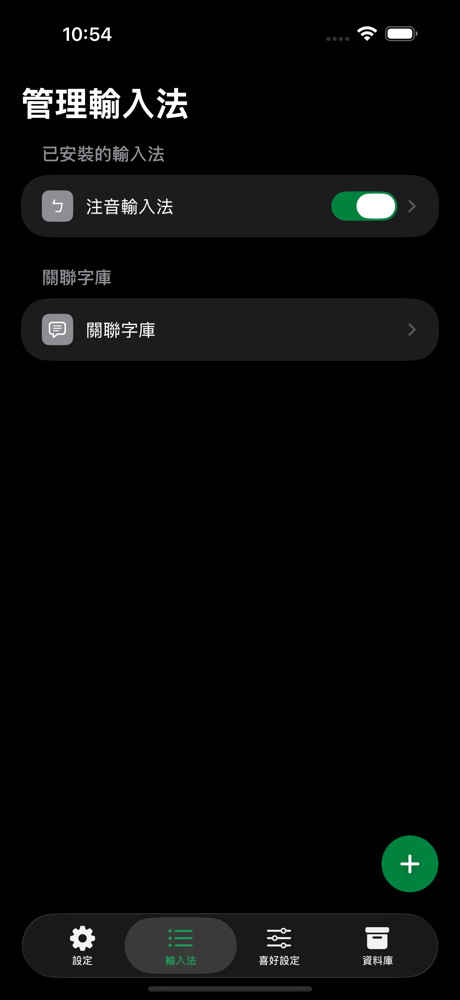 | 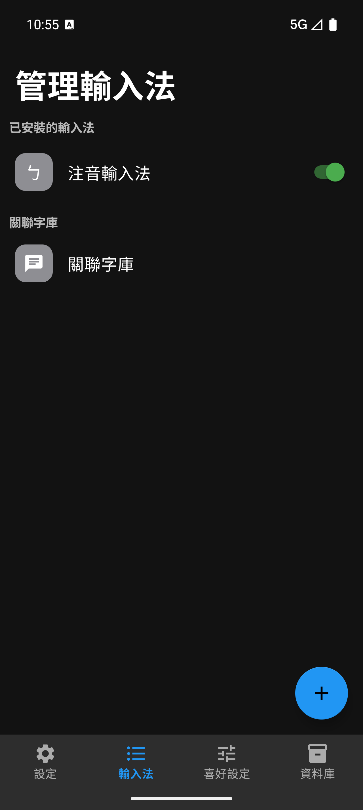 |

| iPad (light) | iPad (dark) |
|---|---|
| 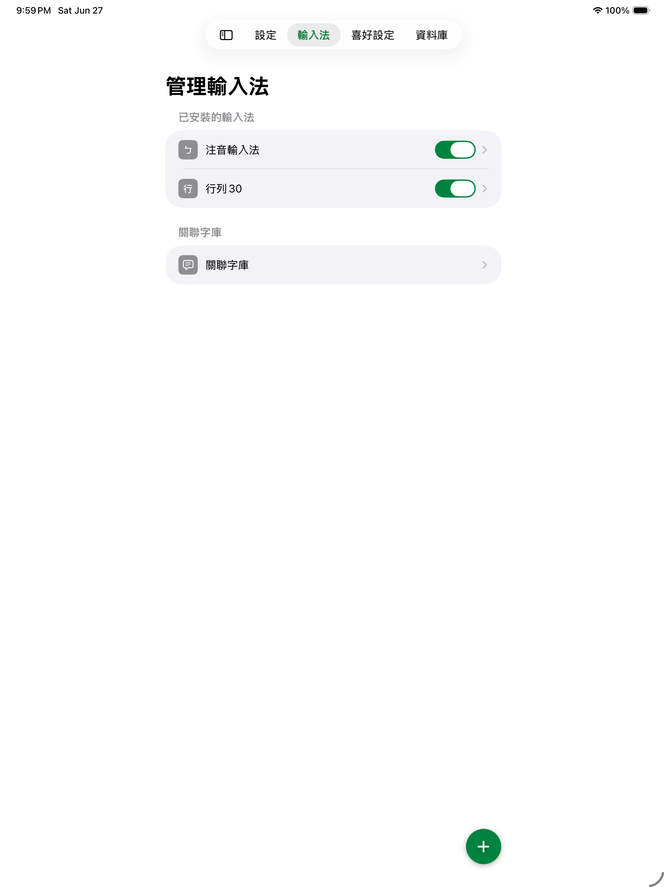 | 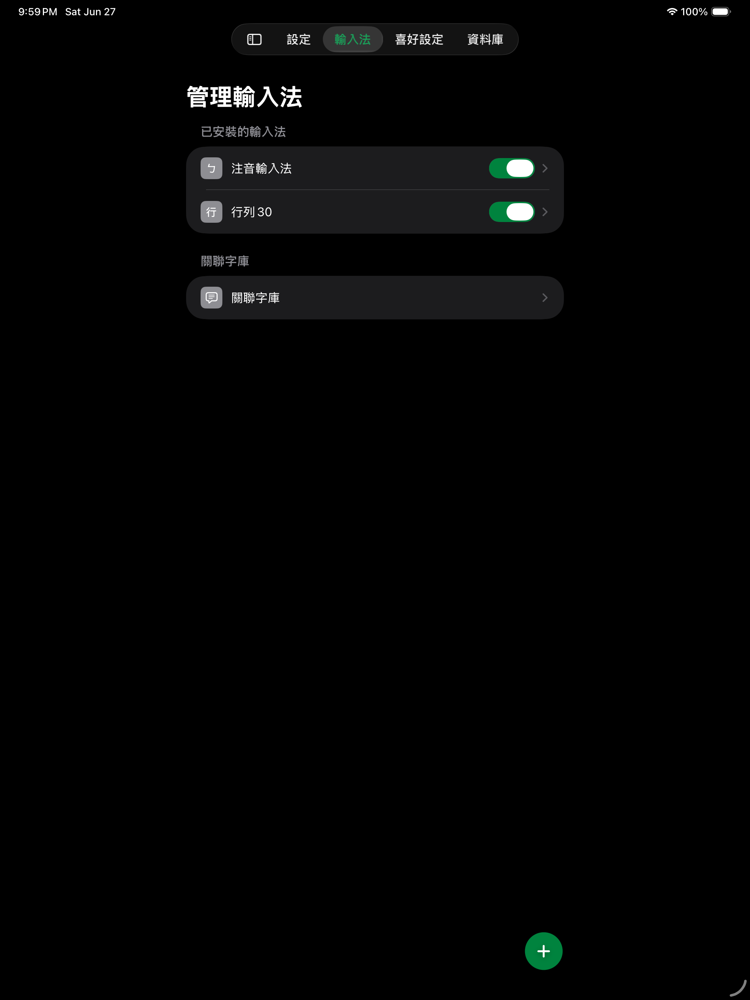 |

```
NavigationStack(path:)
└── List   (NOT editable — no drag-reorder)
    ├── Text("管理輸入法").font(.largeTitle.bold())   // in-content title; nav bar hidden
    ├── Section "已安裝的輸入法"
    │   └── ForEach IMRow  (sorted by im.sortOrder)
    │       ├── HStack
    │       │   ├── IMBadge(character: representativeCharacter(for: row))   // grey rounded tile
    │       │   ├── Text(row.label).font(.body)   // single line, name only
    │       │   └── Toggle("", isOn: row.enabled)
    │       │       .onChange → toggleIM → ManageImController.setIMEnabled(imName:enabled:)
    │       │                            → DBServer.updateIMEnabled(imName:enabled:) + syncIMActivatedState
    │       ├── .onTapGesture → navigationDestination → IMDetailView(im: row)
    │       └── .opacity(row.enabled ? 1.0 : 0.5)
    └── Section "關聯字庫"
        └── IMBadge(systemImage: "text.bubble") + Text("關聯字庫")
            → IMDetailView(im: synthetic IMRow(tableNick: "related"))
+ InstallFAB (round "+" only, bottom-trailing) → IMInstallView   // §5.3
.toolbar(.hidden, for: .navigationBar)
```

- **Enable / disable**: `toggleIM` → `ManageImController.setIMEnabled(imName:enabled:)` → `DBServer.updateIMEnabled(imName:enabled:)` (keyed by **imName**), then `syncIMActivatedState` rebuilds the `keyboard_state` string.
- Enabled rows display at full opacity; disabled rows at half opacity (`.opacity(0.5)`). iOS does not italicise (Android's `HALF_ALPHA_VALUE` style).

> **Add control / no reorder (revision §14).** Drag-to-reorder and the `EditButton` were
> removed — the list is not editable. Add is the **round `+` FAB** (no label), bottom-trailing,
> opening the install flow (§5.3). `im.sortOrder` is still honoured for display order but is no
> longer user-editable here.

#### 5.1.1 Empty state + FAB nudge

When **no IM is installed**, the 已安裝的輸入法 section is replaced by an empty-state
placeholder and the `+` FAB is animated to draw the eye to the only way forward. The
關聯字庫 section stays present below it. The whole nudge is gated on the installed list
being empty and disappears once the first IM is installed.

| iOS | Android |
|---|---|
| 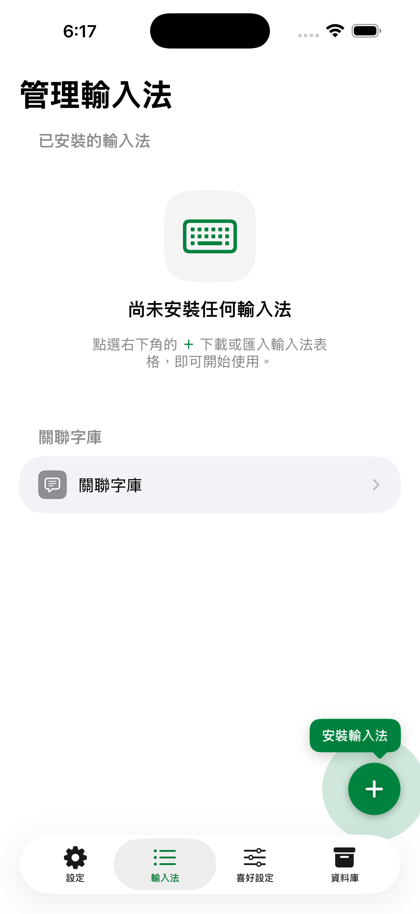 | 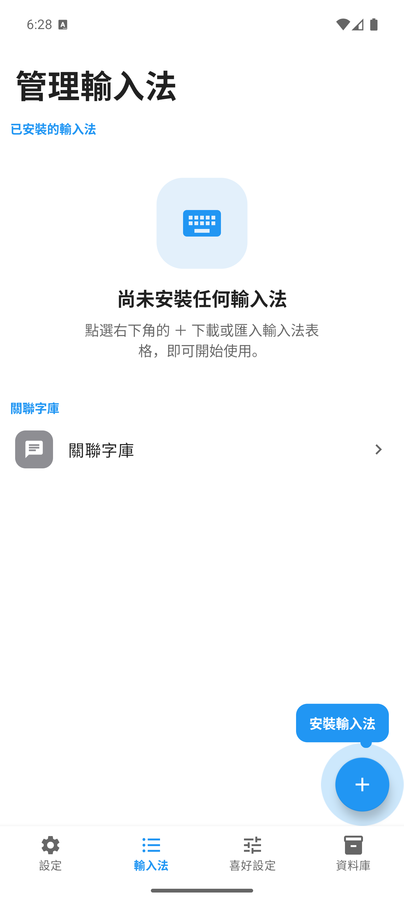 |
| 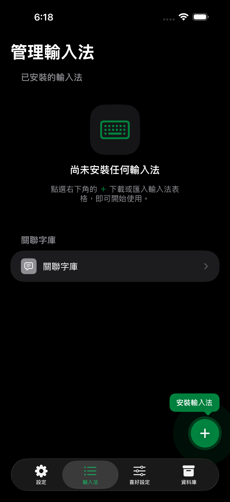 | 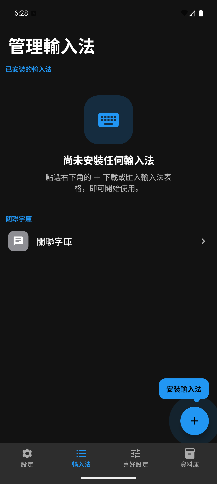 |

| iPad (light) | iPad (dark) |
|---|---|
| 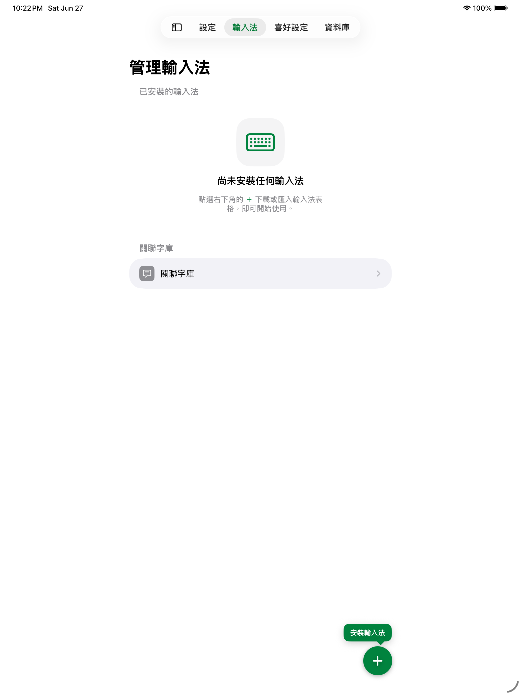 | 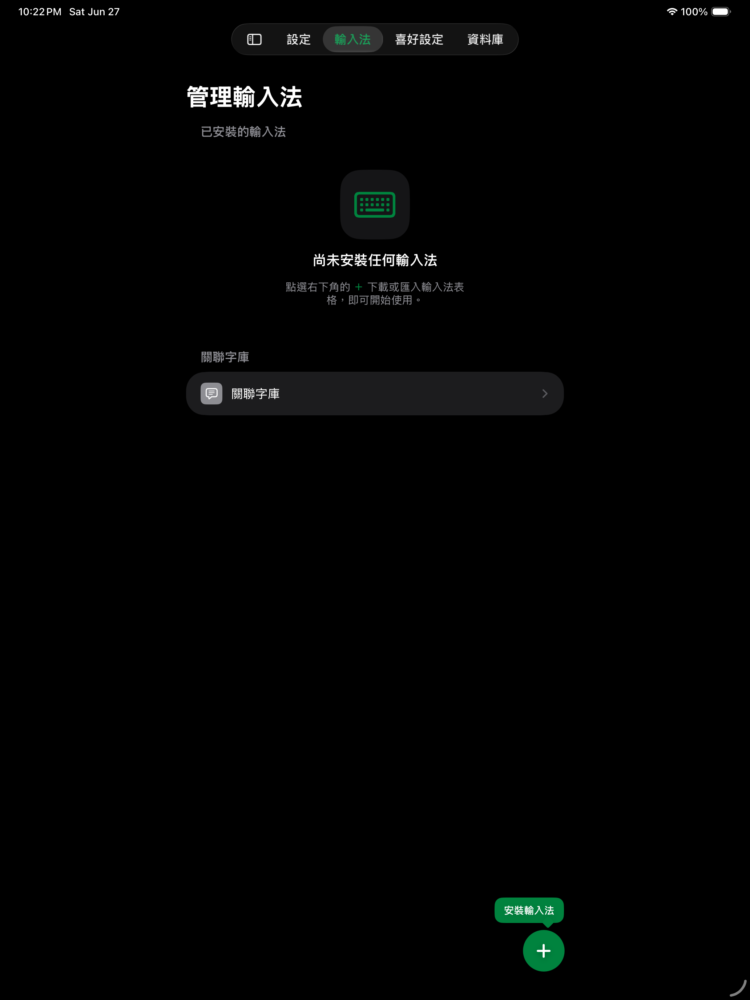 |

**Placeholder** (centered, in place of the IM rows):

- A 96×96 rounded tile (corner radius 28) holding a 46pt `keyboard` glyph — accent
  foreground (brand green) on a quaternary fill (`var(--fill-quaternary)` / iOS
  `quaternarySystemFill`; Android `--md-secondary-container`).
- Title `"尚未安裝任何輸入法"` (20/26 semibold).
- Body `"點選右下角的 ＋ 下載或匯入輸入法表格，即可開始使用。"` (15/21, secondary, max-width
  ~250pt), with the `＋` glyph tinted to the accent to tie it to the FAB.

**FAB nudge** — three coordinated cues, all accent-coloured and **Reduce-Motion safe**:

| Cue | Behavior | Reduced-motion fallback |
|---|---|---|
| Radar pulse | Two staggered rings expand out of the FAB and fade (scale 1 → 2.6, opacity .45 → 0; 2.4s loop, second ring delayed 1.2s) | rings parked static at scale ≈1.9, opacity .18 |
| FAB breath | A periodic scale "breath" (≈1.08) so the FAB reads as the target (2.4s loop) | no animation |
| Callout pill | A bobbing `"安裝輸入法"` pill above the FAB with a downward caret pointing at it (translateY 0 → 4px, 1.8s loop) | static, no bob |

iOS implements these with `withAnimation(...).repeatForever` honouring
`@Environment(\.accessibilityReduceMotion)`; the kit reference encodes the same
behaviour as the `imtab-ring` / `imtab-fab-attn` / `imtab-callout` CSS classes under a
`@media (prefers-reduced-motion: reduce)` guard. This is the destination the Setup
tab's §4.3 `none`-state CTA (`安裝輸入法`) routes to.

### 5.2 IM Detail Screen

Drill-down from any IM row **or** from the synthetic 關聯字庫 entry. Shows metadata, allows changing the soft keyboard layout, and links to the Table Editor. Sections are conditionally shown based on `im.tableNick`.

| iOS | Android |
|---|---|
|  |  |
| 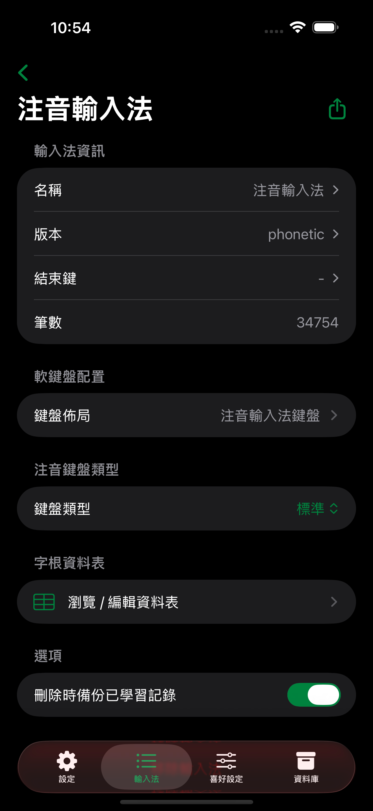 | 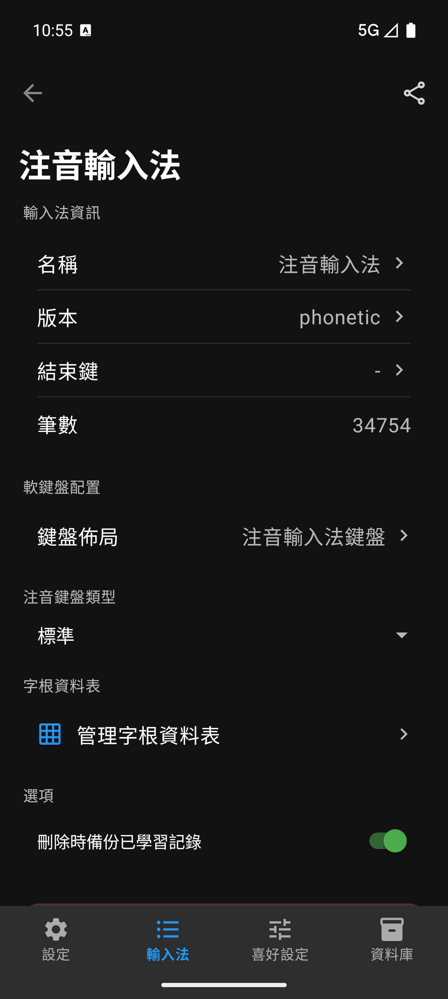 |

| iPad (light) | iPad (dark) |
|---|---|
| 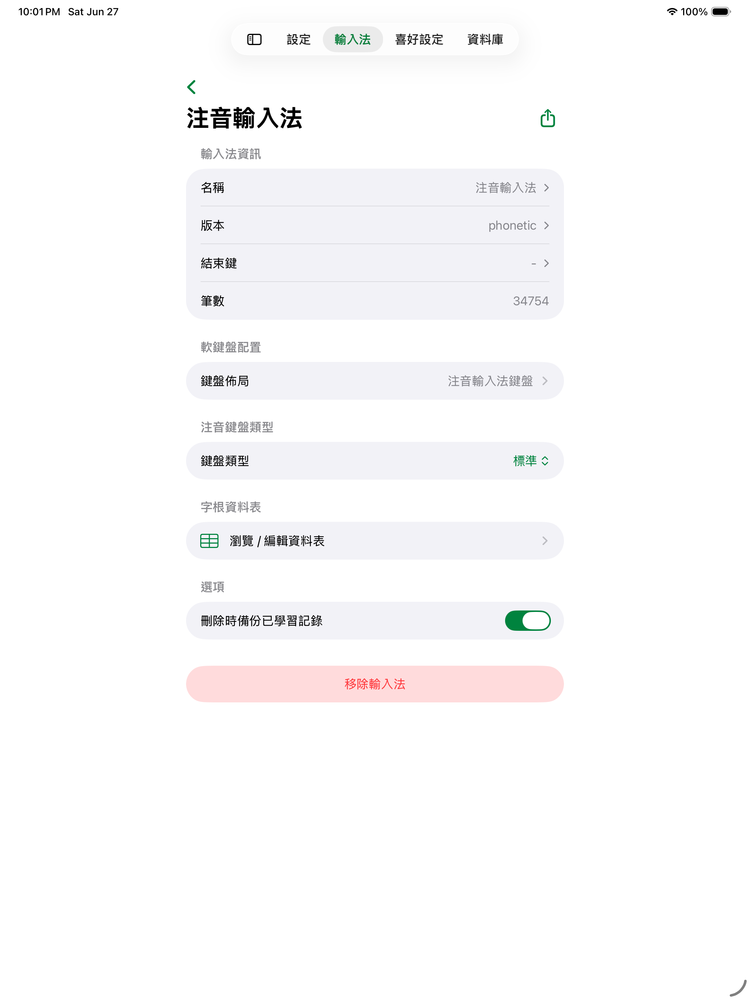 | 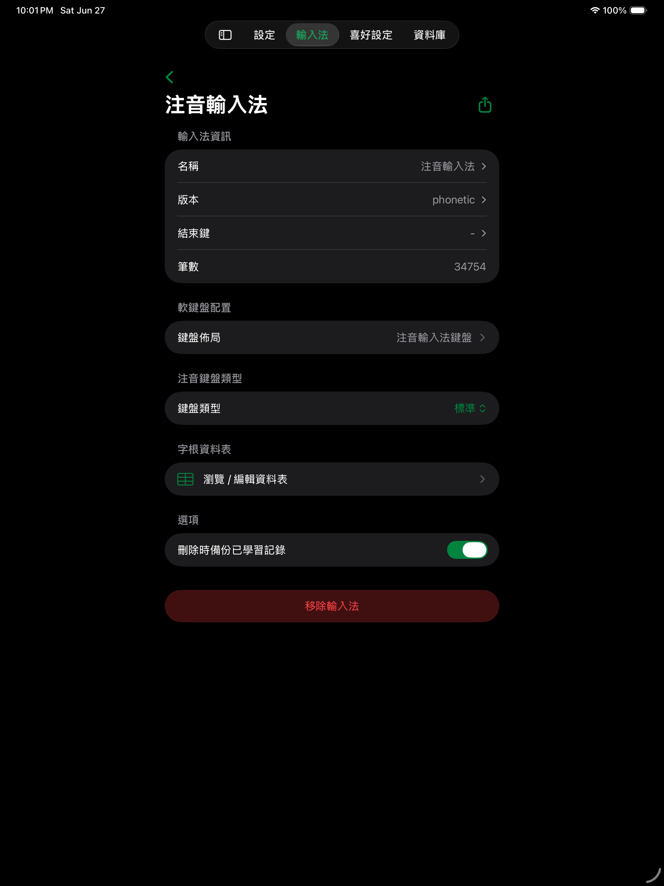 |

```
NavigationStack (continued)
└── IMDetailView(im: IMRow)
    └── List
        ├── Section "輸入法資訊"  (hidden when im.tableNick == "related")
        │   ├── Editable row "名稱"    im.label
        │   │   └── tap → single-field editor "編輯名稱" → ManageImController.updateIMMetadataField(tableNick, "name", value)
        │   │       → DBServer.setImConfig(tableNick, "name", value) → im table row title="name"
        │   ├── Editable row "版本"    DBServer.getImConfig(tableNick, "version") ?? legacy mapping_version ?? "—"
        │   │   └── tap → single-field editor "編輯版本" → ManageImController.updateIMMetadataField(tableNick, "version", value)
        │   │       → DBServer.setImConfig(tableNick, "version", value) → im table row title="version"
        │   ├── Editable row "結束鍵"  DBServer.getImConfig(tableNick, "limeendkey") ?? "—"
        │   │   └── tap → single-field editor "編輯結束鍵" → ManageImController.updateIMMetadataField(tableNick, "limeendkey", value)
        │   │       → DBServer.setImConfig(tableNick, "limeendkey", value) → im table row title="limeendkey"
        │   └── LabeledContent "筆數"    manageImController.countRecords(table: im.tableNick) — fetched in .task
        ├── Section "軟鍵盤配置"  (hidden when im.tableNick == "related")
        │   └── NavigationLink → KeyboardPickerView(im:, onSave: onRefresh)
        │       LabeledContent "鍵盤佈局"  value: keyboardName ("—" if empty)
        │       (resolved via loadKeyboards; falls back to code string if name unavailable)
        ├── Section "注音鍵盤類型"  (shown only when im.tableNick == "phonetic")
        │   └── Picker "鍵盤類型"  pref: phonetic_keyboard_type  default: "standard"
        │       (see §5.2.2 for the 6 options; onChange writes the `im` table row)
        ├── Section "電話鍵盤設定"  (shown only when im.tableNick == "array10")
        │   └── Picker "自動上屏"  pref: auto_commit  default: 0  — 0=無 4–10=Nth stroke auto-commit
        ├── Section "字根對應設定"  (shown only when im.tableNick == "custom")
        │   ├── Toggle "數字字根對應"  pref: accept_number_index  default: false  — 允許使用數字為輸入法字根
        │   └── Toggle "符號字根對應"  pref: accept_symbol_index  default: false  — 允許使用符號為輸入法字根
        ├── Section "倉頡鍵盤選項"  (shown only when im.tableNick == "cj4")
        │   └── Toggle "顯示分號（；）鍵"  pref: cj4_semicolon_key  default: false  (sharedDefaults — App Group)
        │       subtext: 在倉頡鍵盤加上分號（；）字根鍵，需自備含分號字根的倉頡碼表。
        │       When on, programmatically adds a `;` key to the cj/cj_number asdf row (iPad rewrites `；|：` to `:|;`) and forces `searchServer.hasSymbolMapping = true` for cj4.
        ├── Section "字根資料表"  (header = "關聯字庫" when im.tableNick == "related")
        │   ├── [tableNick != "related"] NavigationLink "瀏覽 / 編輯資料表" → RecordListView(tableName: im.tableNick, imLabel: displayName)
        │   └── [tableNick == "related"] NavigationLink "瀏覽 / 編輯關聯字庫" → RelatedListView(isEmbedded: true)
        ├── Section "選項"  (hidden when im.tableNick == "related")
        │   └── Toggle "刪除時備份已學習記錄"
        │       pref key: backup_on_delete_{tableNick}  (UserDefaults.standard, per-IM)
        │       default: true
        ├── Section (no header)  (hidden when im.tableNick == "related")
        │   └── Button "移除輸入法" role: .destructive
        │       → confirmAlert(message varies by toggle state:
        │          true:  "此操作將清除「…」的所有對應資料。\n已學習記錄將先備份，可在重新匯入時還原。確定繼續？"
        │          false: "此操作將清除「…」的所有對應資料，無法還原。確定繼續？")
        │       → manageImController.clearTable(tableNick:, backupLearning: backupOnDelete)
        │          ├── [if backupLearning] SearchServer.backupUserRecords(tableNick)
        │          ├── SearchServer.clearTable → LimeDB.clearTable (DELETE records + resetImConfig)
        │          ├── LIMEPreferenceManager.syncIMActivatedState (rebuilds keyboard_state)
        │          ├── markKeyboardCacheDirty
        │          └── invalidate (triggers IMListView reload)
        │       → dismiss IMDetailView; onRefresh()
        └── Section (no header)  (shown only when im.tableNick == "related")
            └── Button "清除關聯字庫" role: .destructive
                → confirmAlert("此操作將清除所有關聯字資料，無法還原。確定繼續？")
                → manageRelatedController.clearRelated()
```

**Editable metadata rows**:
- `名稱`, `版本`, and `結束鍵` stay as independent rows, not a combined editor.
- Each row must show an edit/disclosure affordance (`chevron.right` on iOS, trailing chevron row on Android) so users can tell the field is editable.
- `名稱` cannot be empty; `版本` and `結束鍵` may be empty, displayed as `—`, and still persist empty `title="version"` / `title="limeendkey"` values when saved. Empty `limeendkey` means the table has no Lime runtime end-key commit triggers.
- Saving writes only the tapped field through the Controller → `DBServer.setImConfig(...)` path. UI code must not write directly to `LimeDB`.
- After a successful save, the detail page updates immediately and the IM list refreshes so the list label uses the edited name.
- The synthetic `related` row is read-only for metadata and hides the version/endkey rows.

**Synthetic 關聯字庫 row**: `IMRow(id: -1, imName: "related", label: "關聯字庫", tableNick: "related", ...)` — constructed inline in `IMListView`; `.task` skips keyboard loading for this row.

**Share / Export** (toolbar `square.and.arrow.up` button, all rows including 關聯字庫):
- **iOS**: tapping opens a `confirmationDialog` with **format-only** choices, then presents the iOS share sheet (`ShareSheet` / `UIActivityViewController`) — there is **no** separate 分享-vs-本機儲存 split. Non-related IMs show **`.lime（文字）`** and **`.limedb（資料庫）`**; 關聯字庫 shows only **`.limedb（資料庫）`**.
- **Android**: the dialog splits each format into **分享** and **本機儲存** (non-related: 分享 `.lime` / 本機儲存 `.lime` / 分享 `.limedb` / 本機儲存 `.limedb`; 關聯字庫: 分享 `.limedb` / 本機儲存 `.limedb`). 分享 uses `ACTION_SEND` + `FileProvider`; 本機儲存 uses SAF `ACTION_CREATE_DOCUMENT` (no storage permission / Downloads path).
- `.lime（文字）` export path: `SetupImController.exportIMAsText` → `DBServer.exportTxtTable`.
- `.limedb（資料庫）` export path: `exportIMAsLimedb` / `exportRelatedAsLimedb` → `DBServer.exportZippedDb` / `DBServer.exportZippedDbRelated`.
- A progress overlay shows during export; cancelling the picker performs no export.

> `keyboard_list` (last-used IM) is **not** cleared after remove — mirrors Android behaviour.
> The keyboard extension will naturally find no candidates if the cleared IM is still active.

> The "字根對應設定" section is exclusive to the custom IM (`im.tableNick == "custom"`). All built-in IMs hardcode their own `hasNumberMapping` / `hasSymbolMapping` values in `initializeIMKeyboard()` and ignore these prefs.

> The "倉頡鍵盤選項" section is exclusive to cj4 (`im.tableNick == "cj4"`). The `cj4_semicolon_key` pref lives in the shared App-Group prefs because the keyboard extension reads it.

> The "注音鍵盤類型" section is exclusive to the phonetic IM (`im.tableNick == "phonetic"`). It lives on the IM detail page (not the global 喜好設定 tab) because `phonetic_keyboard_type` only affects the phonetic IM — both the DB-level letter-to-bopomofo remap and the visible keyboard layout. See §5.2.2 for details.

#### 5.2.1 KeyboardPickerView — Soft Keyboard Selection

Equivalent to Android's `ManageImKeyboardDialog`.

```
NavigationStack (continued)
└── KeyboardPickerView(im:, onSave:)
    └── List
        └── ForEach keyboards (from loadKeyboards; filtered to !isDisabled)
            └── HStack { Text(kb.desc), Spacer(),
                        Image(systemName: "checkmark").hidden(!isSelected) }
               .onTapGesture → manageImController.setKeyboard(forIM:keyboard:) → onSave?() → dismiss
               selectedCode seeded from im.keyboardId so checkmark shows immediately
.constrainedDetailLayout("選擇鍵盤佈局")   // custom large-title layout (not .navigationTitle)
```

- Selection is persisted via `db.setIMKeyboard(table:description:code:)`.
- For the **注音** IM specifically, changing the layout here must also update the `phonetic_keyboard_type` preference so the keyboard extension picks up the correct layout.

#### 5.2.2 注音鍵盤類型 (Phonetic Keyboard Type)

Shown only when `im.tableNick == "phonetic"`. A single `Picker` bound to the `phonetic_keyboard_type` preference.

| UI Control | Pref Key | Type | Default | Notes |
|---|---|---|---|---|
| `Picker` "鍵盤類型" | `phonetic_keyboard_type` | String | `"standard"` | See options below |

**Phonetic keyboard type options**:

| Value | Display Label |
|---|---|
| `standard` | 標準 |
| `et_41` | 倚天 41 鍵 |
| `eten26` | 倚天 26 鍵 (英文) |
| `eten26_symbol` | 倚天 26 鍵 (符號) |
| `hsu` | 許氏 (英文) |
| `hsu_symbol` | 許氏 (符號) |

**Live update**: when this picker value changes, call `DBServer.setImConfigKeyboard("phonetic", kb)` to update the `im` table immediately (mirrors Android's `onSharedPreferenceChanged` in `LIMEPreference`). Use SwiftUI's `.onChange(of: phoneticKeyboardType)`:

```swift
.onChange(of: phoneticKeyboardType) { newType in
    updatePhoneticKeyboard(type: newType)   // writes im table
}
```

The keyboard extension re-reads both the pref and the DB row at the top of `initOnStartInput()` via `refreshPhoneticKeyboardPrefs()`, so the visible layout and the DB-level remap update on the next keyboard show — no extension restart required.

### 5.3 IM Install Screen — Download & Import

Entry point reachable from the "下載 / 匯入輸入法" NavigationLink in §5.1. Each IM is a top-level `DisclosureGroup`; cloud download options appear only for built-in IMs.

> **No manual refresh action.** The install screen has **no refresh button** in the
> top bar (the former upper-right ↻ was removed on both platforms). Installed state is
> a local DB check (`tableHasData`) that only changes as a result of an install/import
> performed on this screen, and every such path re-queries it automatically — iOS via
> `refreshInstallStates()` on `.onAppear` plus the `@Published installedTables` update
> after each import; Android via `loadFamilyListAsync()` on open and `onInstallComplete()`
> after each install. There is nothing a manual refresh would surface that these don't.

| iOS | Android |
|---|---|
|  |  |
| 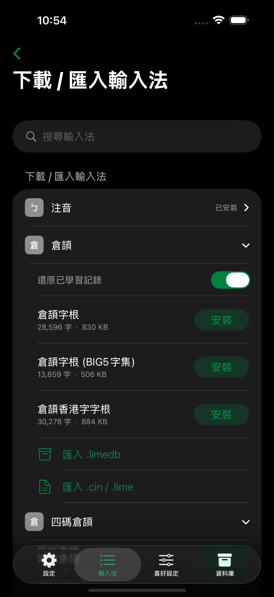 | 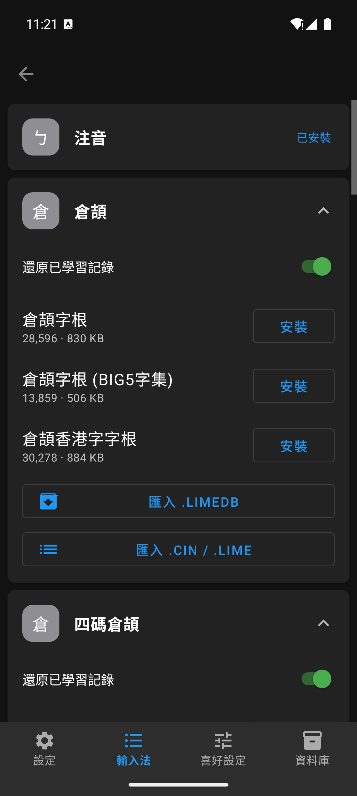 |

| iPad (light) | iPad (dark) |
|---|---|
| 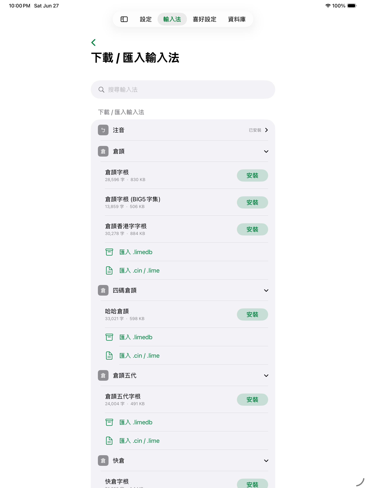 | 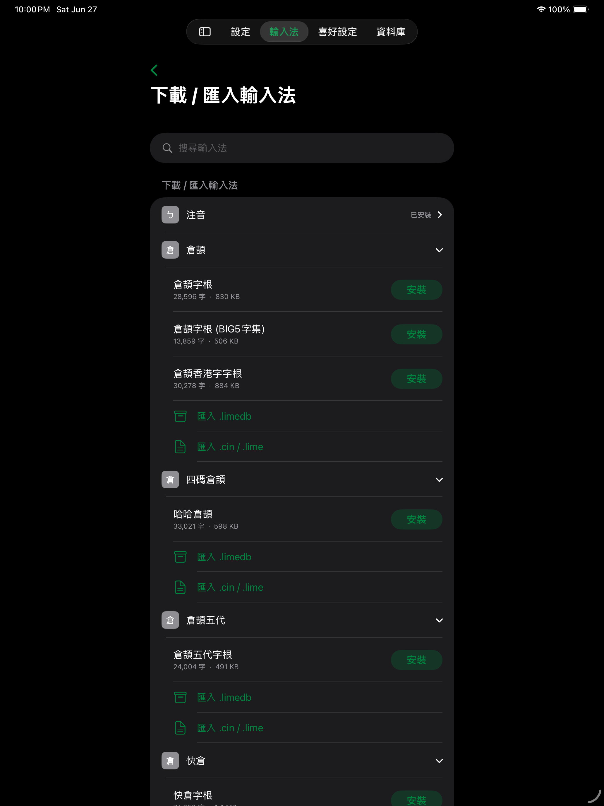 |

The screen is **data-driven** from `IMCatalog.families` (not a hand-written per-IM list): one
generic `FamilyInstallGroup` `DisclosureGroup` is rendered per family, and cloud rows come from
each family's `variants`. The per-variant display labels (e.g. ☁ OpenVanilla 注音字根, ☁ 倉頡香港字字根,
☁ Unicode 3+4 碼詞庫版) live in `IMCatalog`.

```
NavigationStack (continued)
└── IMInstallView
    └── List
        ├── Section: inline search bar (magnifyingglass + TextField "搜尋輸入法" + clear ✕)
        │            filters IMCatalog.families → filteredFamilies
        ├── ForEach(filteredFamilies)   // 13 families: 注音 倉頡 快倉 倉頡五代 速成 大易 輕鬆
        │   │                           //              行列 行列10 拼音 華象直覺 筆順五碼 自建
        │   └── FamilyInstallGroup(family)        // a DisclosureGroup
        │       ├── [if hasBackup] Toggle "還原已學習記錄"
        │       │     key: restore_on_import_<family.id> (UserDefaults.standard) default: true
        │       │     hasBackup = checkBackupTable(candidate tableName) OR user_backed_up_<tableNick> flag
        │       ├── ForEach(family.variants) VariantRow(variant)   // cloud "☁" rows; empty for 自建
        │       │     → downloadManager.install(variant, restoreLearning: restoreOnImport)
        │       ├── Button "匯入 .limedb"     → beginImport(for: family.id, requestedType: .db)
        │       └── Button "匯入 .cin / .lime"  → beginImport(for: family.id, requestedType: .txt)
        │       // 自建 (custom): no cloud variants; after a successful import → seedCustomIM()
        ├── DisclosureGroup "關聯字庫"  systemImage: "text.bubble"
        │   └── Button "匯入 .limedb" → beginImport(for: "related", .relatedDb)
        │         → DBServer.importDbRelated → manageRelatedController.invalidate()
        └── [if statusMessage non-empty] Section "狀態" → Text(statusMessage).font(.footnote).secondary
    // Import flow: beginImport → .fileImporter → handleSelectedImportURL →
    //   setupController.importDBFile(...) / importTxtFile(...). pendingTableName fixes the IM code;
    //   source filenames are metadata only. There are no downloadIM / importFromAttachedDB /
    //   importTxtTable functions and no CLOUD_* constants — those are illustrative shorthand only.
```

#### 5.3.1 Progress Overlay

When a **related-DB import** runs (`pickerType == .relatedDb`), show a centred `ProgressView("匯入中…")` overlay. `.db` / `.txt` IM imports surface a status message instead (no blocking overlay), and per-variant cloud downloads show inline progress in the `VariantRow` / `InstallButton`. Import runs via `.fileImporter` (not a sheet), so there is no `interactiveDismissDisabled`.

#### 5.3.2 Download Behaviour

1. `IMDownloadManager` downloads the `.zip` / `.limedb` to a temp dir and **validates it** (min ~100 KB; anything smaller is treated as a failed download).
2. If `.zip`, extract it.
3. Import the database via `importDatabaseFile(server:url:tableName:)`; if restoring learned records, `restoreUserRecords` then `dropBackupTable`.
4. `server.registerIM(imName:tableName:label:keyboardId:)` inserts the IM row, then `syncIMActivatedState` rebuilds `keyboard_state` so the IM appears in the list. (There is **no** `seedDefaultIMs`.)
5. Clean up the temp file.

#### 5.3.3 Local File Import

- **Named IM rows**: `tableName` is fixed to the IM code shown in the `DisclosureGroup` header.
- **自建 (custom) row**: same pipelines with `tableName = "custom"`. After import, call `db.seedCustomIM()` to upsert `(code: "custom", title: "自建", keyboard: "lime_cj")` into the `im` table.
- After any import, reload the IM list in §5.1.

---

## 6. Feature: IM Table Editor

**Purpose**: Browse, search, and perform CRUD on the character mapping records of each installed IM (`mapping` tables) and on the cross-IM related-phrase pairs (`related` table). Corresponds to Android's `ManageImFragment` and `ManageRelatedFragment`.

### 6.1 Mapping Record List — RecordListView

Reached via NavigationLink from §5.2 ("瀏覽 / 編輯資料表").

The editor status line is state-specific:

| State | Status / unlock hint |
| --- | --- |
| Full Access confirmed, LIME active | `"完整取用已開啟，碼表編輯功能已啓用。"` |
| Full Access off, LIME active | `"開啟完整取用以顯示實際分數及啓用碼表編輯功能"` |
| Full Access confirmed, LIME not active | `"將目前鍵盤切換為萊姆輸入法以顯示實際分數及開啓編輯功能"` |
| Full Access missing/unknown, LIME not active/unknown | `"開啟完整取用並將鍵盤切換至萊姆輸入法以顯示實際分數及開啓編輯功能"` |

| iOS | Android |
|---|---|
| 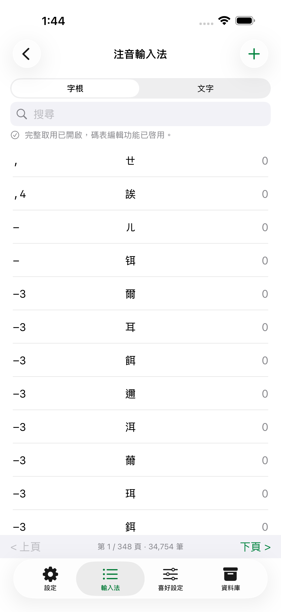 |  |
| 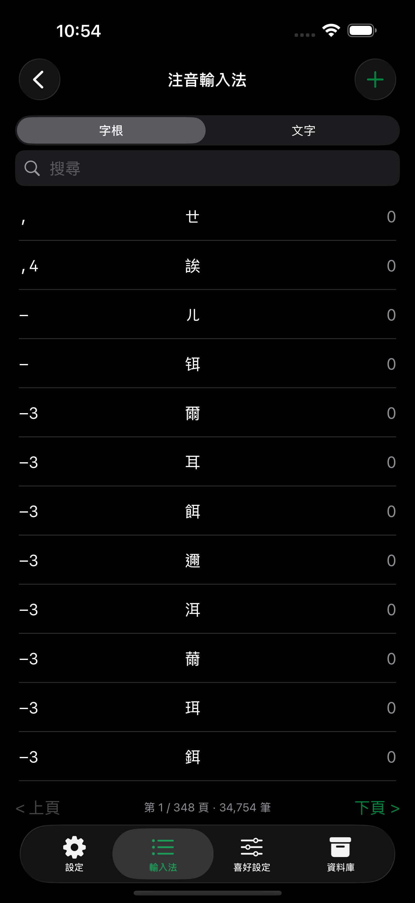 | 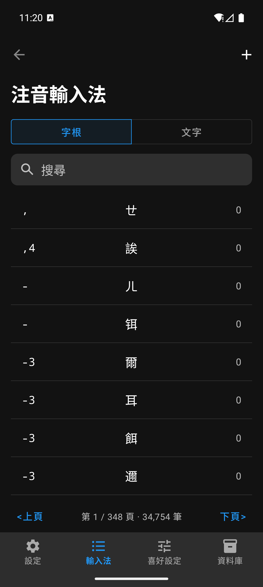 |

| iPad (light) | iPad (dark) |
|---|---|
| 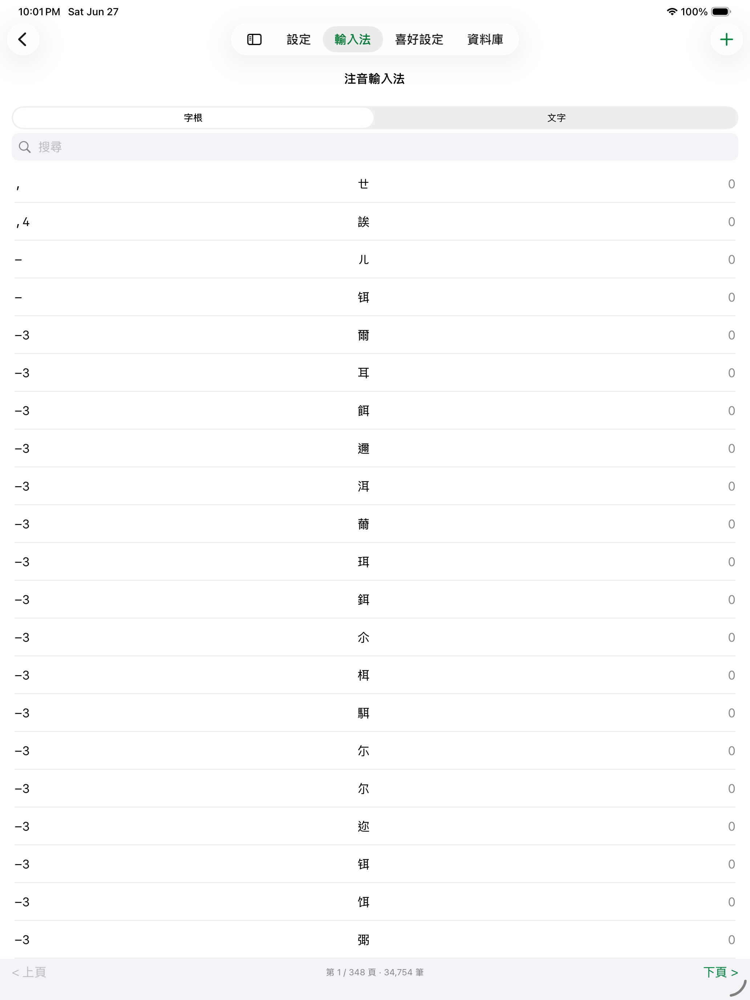 | 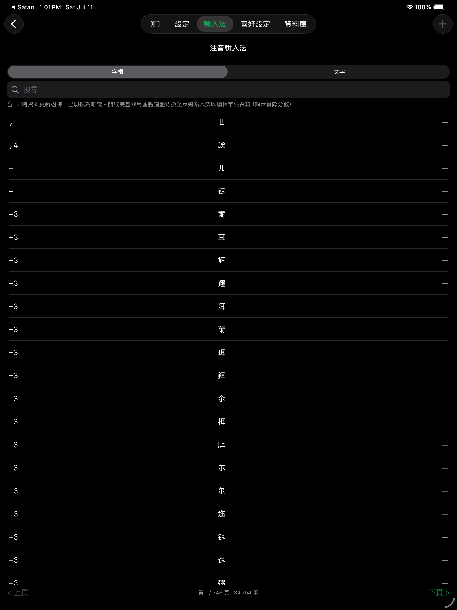 |

```
NavigationStack (continued)
└── RecordListView(tableName: String, imLabel: String)
    ├── Picker "搜尋模式" segmented: ["字根", "文字"]   // above the search field
    ├── inline search bar: HStack { magnifyingglass; TextField("搜尋", text: $query); clear ✕ }   // NOT .searchable()
    ├── List
    │   └── ForEach records (page of 100)
    │       ├── HStack   // three columns, no Spacer
    │       │   ├── Text(record.code).monospaced   .frame(maxWidth: .infinity, .leading)
    │       │   ├── Text(record.word)              .frame(maxWidth: .infinity, .leading)
    │       │   └── Text("\(record.score)").secondary   .frame(width: 48, .trailing)
    │       ├── .onTapGesture → sheet: EditRecordView          // row tap edits
    │       └── .swipeActions(edge: .trailing) {              // single delete action
    │           Button("刪除", role: .destructive) → confirmAlert → deleteRecord(table:id:)
    │       }
    └── HStack "pagination bar" {
        Button("‹ 上頁")   .disabled(page == 0)
        Spacer()
        Text("第 \(page+1) / \(totalPages) 頁 · \(totalCount) 筆")
        Spacer()
        Button("下頁 ›")   .disabled(isLastPage)
    }
.toolbar {
    ToolbarItem(placement: .navigationBarTrailing) {
        Button(systemImage: "plus") → sheet: AddRecordView
    }
}
.navigationTitle(imLabel)
```

**Pagination**: 100 records per page (Android `LIME.IM_MANAGE_DISPLAY_AMOUNT`). Changing page or query resets to page 0.

**Search modes**:
- **字根**: prefix match on `code` column.
- **文字**: contains match on `word` column.

#### 6.1.1 AddRecordView (sheet) — Equivalent to `ManageImAddDialog`

```
Form
├── Section "新增資料列"
│   ├── TextField "字根 (code)"
│   ├── TextField "文字 (word)"
│   └── ScoreInputRow "分數"
│       ├── Button(systemImage: "minus.circle") → score = max(0, score - 1)
│       ├── TextField(value: score, keyboard: numberPad, width: 64)
│       └── Button(systemImage: "plus.circle")  → score = min(9999, score + 1)
└── Section
    └── Button "確認新增" → guard !code.isEmpty && !word.isEmpty
                          → manageImController.addRecord(table:code:word:score:)
                          → dismiss
```

Android `ManageImAddSheet` must expose the same row-editor content:
`取消` framed button, title/subtitle `新增資料列`, fields `字根` and `文字`,
score row with `-`, directly editable numeric score, and `+`, then a framed
rectangular `確認新增` action. The bottom sheet remains scrollable and IME-aware
per issue #65.

#### 6.1.2 EditRecordView (sheet) — Equivalent to `ManageImEditDialog`

```
Form
├── Section "編輯資料列"
│   ├── TextField "字根"  binding: code
│   ├── TextField "文字"  binding: word
│   └── ScoreInputRow "分數"       // same editable score control as AddRecordView
├── Section
│   └── Button("儲存") → updateRecord(table:id:code:word:score:) → dismiss   // no confirm on save
└── Section
    └── Button("刪除", role: .destructive) → confirmAlert → deleteRecord(table:id:) → dismiss
```

Validation on Save: code and word must not be empty.

Android `ManageImEditSheet` mirrors the same content with title/subtitle
`編輯資料列`, prefilled `字根`/`文字`, directly editable numeric score, framed
rectangular `刪除`, and framed rectangular `儲存`.

### 6.2 Related Phrase List — RelatedListView (embedded in §5.2)

The related-phrase editor is reached via **輸入法 → 關聯字庫 → 瀏覽 / 編輯關聯字庫**. It is no longer a standalone tab. `RelatedListView` accepts `isEmbedded: Bool`; when `true` the inner `NavigationView` wrapper is omitted so it can be pushed as a navigation destination without nesting. Equivalent to Android's `ManageRelatedFragment`. It uses the same state-specific read-only unlock copy as §6.1.

| iOS | Android |
|---|---|
|  |  |
| 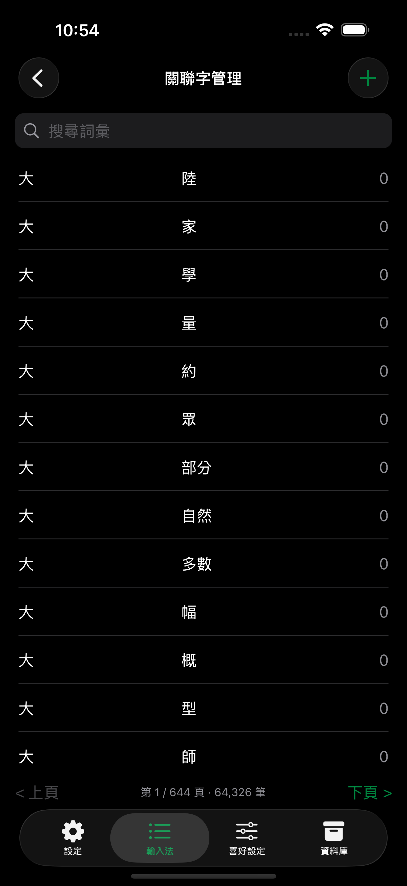 | 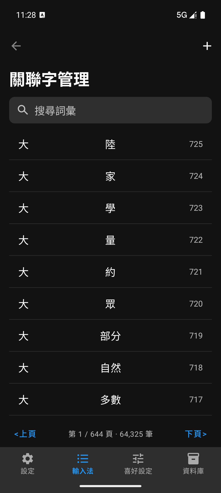 |

| iPad (light) | iPad (dark) |
|---|---|
| 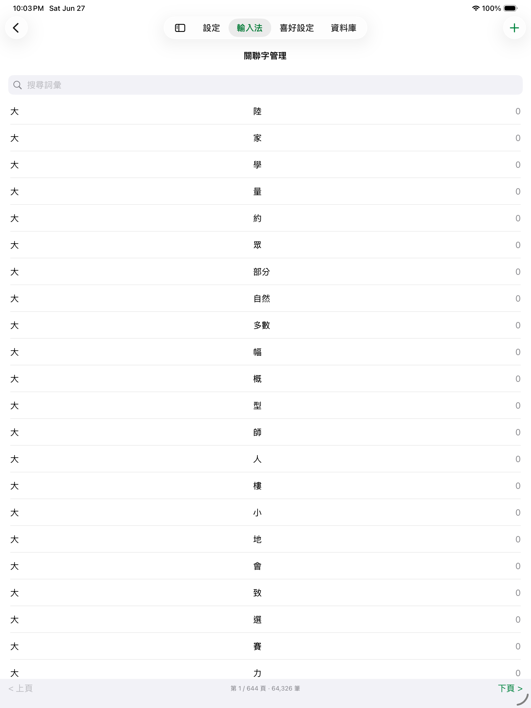 | 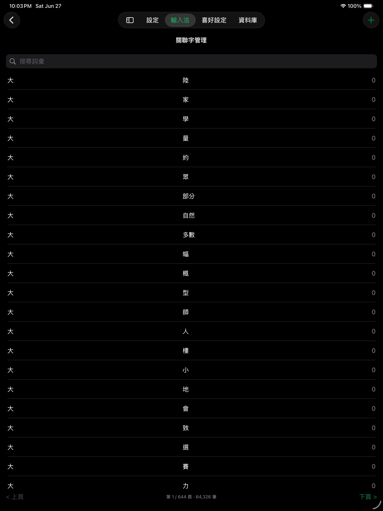 |

```
NavigationStack (continued from §5.2)
└── RelatedListView(isEmbedded: true)
    ├── inline search bar: HStack { magnifyingglass; TextField("搜尋詞彙", text: $query); clear ✕ }   // NOT .searchable()
    ├── List
    │   └── ForEach relatedList (page of 100)
    │       ├── HStack   // three columns, no bold / no Spacer
    │       │   ├── Text(r.parentWord)   .frame(maxWidth: .infinity, .leading)
    │       │   ├── Text(r.childWord)    .frame(maxWidth: .infinity, .leading)
    │       │   └── Text("\(r.score)").secondary   .frame(width: 48, .trailing)
    │       ├── .onTapGesture → sheet: EditRelatedView          // row tap edits
    │       └── .swipeActions(edge: .trailing) {              // single delete action
    │           Button("刪除", role: .destructive) → confirmAlert → deleteRelated(id:)
    │       }
    └── HStack "pagination bar"  (same pattern as §6.1)
.toolbar {
    ToolbarItem(placement: .navigationBarTrailing) {
        Button(systemImage: "plus") → sheet: AddRelatedView
    }
}
.navigationTitle("關聯字管理")
```

**Pagination**: 100 per page; search resets to page 0.

**Search**: prefix / contains match on `word` column.

#### 6.2.1 AddRelatedView (sheet) — Equivalent to `ManageRelatedAddDialog`

```
Form
├── Section "新增資料列"
│   ├── TextField "詞彙 (word)"
│   ├── TextField "關聯字 (related)"
│   └── ScoreInputRow "分數"
│       ├── Button(systemImage: "minus.circle") → score = max(0, score - 1)
│       ├── TextField(value: score, keyboard: numberPad, width: 64)
│       └── Button(systemImage: "plus.circle")  → score = min(9999, score + 1)
└── Section
    └── Button("確認新增") → guard both non-empty
                         → manageRelatedController.addRelated(parentWord:childWord:score:)
                         → dismiss
```

The score is persisted to the `related.score` value on add. Default score is
`0`; both platforms must accept direct numeric entry and clamp values to
`0...9999`.

#### 6.2.2 EditRelatedView (sheet) — Equivalent to `ManageRelatedEditDialog`

```
Form
├── Section "編輯資料列"
│   ├── TextField "詞彙"    binding: word
│   ├── TextField "關聯字"  binding: related
│   └── ScoreInputRow "分數"       // initialized from existing related score
├── Section
│   └── Button("儲存")                    → updateRelated(id:parentWord:childWord:score:)
│                                        → dismiss   // no confirm on save
└── Section
    └── Button("刪除", role: .destructive) → confirmAlert → deleteRelated(id:) → dismiss
```

The score field must update the persisted related-row score and the list score
shown in `RelatedListView` / `ManageRelatedFragment`.

### 6.3 Cross-platform Add/Edit Row Editor Contract

This contract applies to all four row-editor sheets:

- IM add: `AddRecordView` / `ManageImAddSheet`
- IM edit: `EditRecordView` / `ManageImEditSheet`
- Related add: `AddRelatedView` / `ManageRelatedAddSheet`
- Related edit: `EditRelatedView` / `ManageRelatedEditSheet`

Required structure:

```
RowEditorSheet
├── Cancel action: "取消"
├── Title: "新增資料列" or "編輯資料列"
├── Subtitle: same as title
├── Field group
│   ├── IM:      "字根"/"文字"
│   └── Related: "詞彙"/"關聯字"
├── Score row
│   ├── Label "分數"
│   ├── decrement button "-"
│   ├── directly editable numeric field
│   └── increment button "+"
└── Actions
    ├── Add:  framed "確認新增"
    └── Edit: framed "儲存" and destructive framed "刪除"
```

Platform styling requirements:

- iOS uses `Form` sheet styling and SF Symbol score buttons.
- Android uses the #65 full-height, scrollable, IME-aware bottom sheet.
- Android action buttons must keep the existing rectangular Material outline
  vocabulary; do not use pill-shaped save/cancel buttons.
- Score `-` / `+` controls may remain circular/icon-like on both platforms.
- Score is editable by direct typing as well as by the `-` / `+` controls.

Visual verification evidence:

The related add/edit sheet screenshots were captured during issue verification, but
the original `../.Codex/txt/` image files are not part of this repository. Do not
treat those historical captures as reusable manual screenshots unless fresh files are
added under `docs/` or `assets/screenshots/`.

---

## 7. Feature: DB Manager (資料庫 Tab)

**Purpose**: Backup the entire `lime.db` file and restore from a previous backup. Corresponds to the backup/restore buttons in Android's `SetupImFragment`.

| iOS | Android |
|---|---|
|  |  |
| 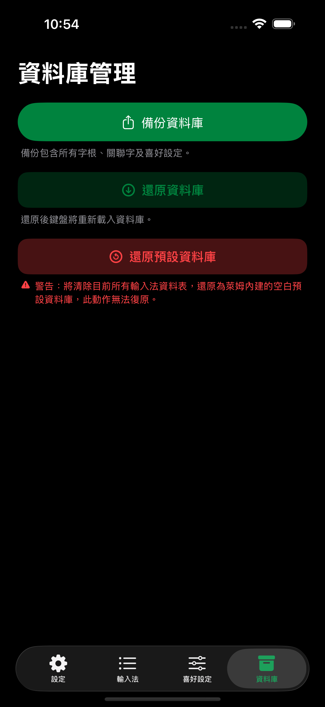 | 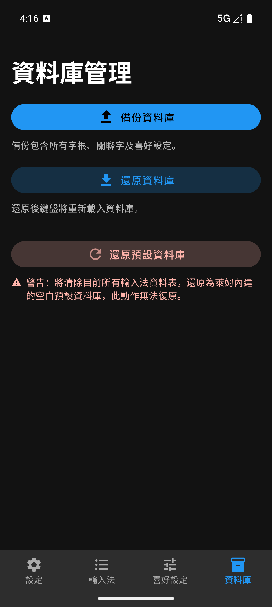 |

| iPad (light) | iPad (dark) |
|---|---|
| 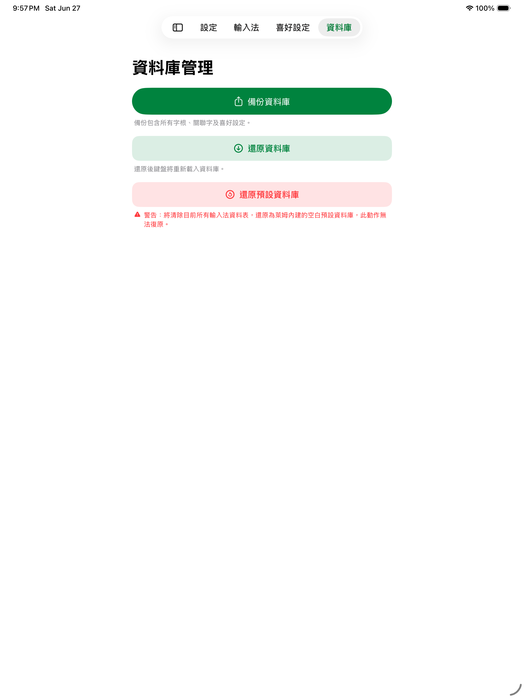 | 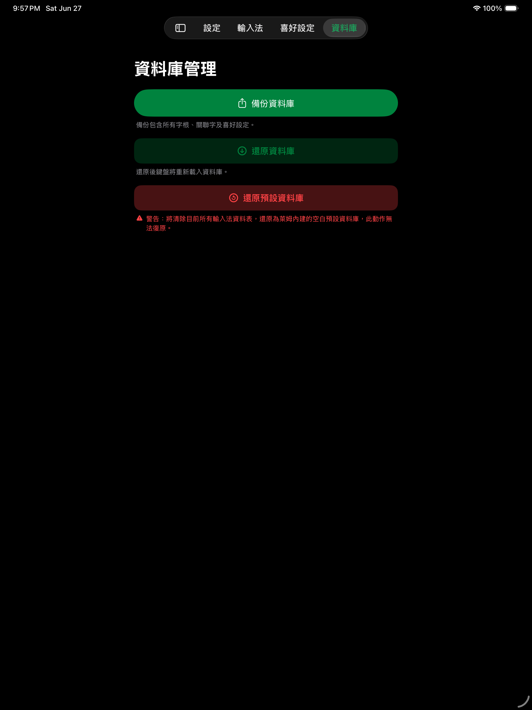 |

### 7.1 Layout

No second-level navigation exists in this tab, so it uses a `ScrollView` + `VStack` layout
(same pattern as the 設定 tab) rather than `List`. This gives a centred 560 pt column on iPad
and a standard full-width layout on iPhone.

```
NavigationStack
└── ScrollView
    └── VStack(alignment: .leading, spacing: 0)   // .padding(.horizontal, 24)
        │                                           // .frame(maxWidth: 560).frame(maxWidth: .infinity)
        │
        ├── Text("資料庫管理").font(.largeTitle).bold()   // rendered in-content on ALL devices
        │
        ├── dbAction(footer: backupFooter)     // ready: backup note; otherwise unlock guidance
        │   └── Button "備份資料庫"  systemImage: "square.and.arrow.up"
        │       .buttonStyle(.borderedProminent).controlSize(.large)   // filled primary action
        │       .disabled(isWorking || faState != .confirmedOn || !activeThisSession)
        │       → performBackup() → UIActivityViewController (Files, AirDrop, Mail…)
        │
        ├── dbAction(footer: "還原後鍵盤將重新載入資料庫。")
        │   └── Button "還原資料庫"  systemImage: "arrow.down.circle"
        │       .buttonStyle(LimeTonalButtonStyle())                   // tonal (NOT red)
        │       → showRestoreConfirm → alert → fileImporter([.item]) → performRestore(from:)
        │
        ├── dbAction(footer: "警告：將清除目前所有輸入法資料表，還原為萊姆內建的空白預設資料庫，此動作無法復原。", warning: true)
        │   └── Button "還原預設資料庫"  systemImage: "arrow.counterclockwise.circle"
        │       .buttonStyle(LimeTonalButtonStyle(tint: SettingsTheme.destructive))   // red tonal
        │       → showInitConfirm → alert → restoreBundledDatabase()
        │
        └── [if statusMessage non-empty] Label(statusMessage, systemImage: "info.circle")
                .font(.footnote).foregroundColor(.secondary)
    .toolbar(.hidden, for: .navigationBar)   // nav bar hidden on all devices
    // Both restore actions share ONE alert:
    //   .alert("確認還原") { Button("還原", role: .destructive); Button("取消", role: .cancel) }
    //   message: "還原後目前所有資料將被取代，確定繼續？"
```

`dbAction(footer:warning:content:)` is a private `@ViewBuilder` helper that renders a full-width
button above a footnote footer — **no section header** (the button labels are self-explanatory).
When `warning: true` the footer is a red warning carrying a leading `exclamationmark.triangle.fill`
(used by 還原預設資料庫).

**iPad width cap.** The inner `VStack` carries `.frame(maxWidth: 560).frame(maxWidth: .infinity)`
so the content sits in a centred column. The `資料庫管理` title is rendered in-content
(`.largeTitle.bold()`) on **all** devices and the navigation bar is hidden everywhere, so the
layout is identical on iPhone and iPad.

### 7.2 Backup Behaviour

Backup is disabled unless `faState == .confirmedOn && activeThisSession == true`. Footer copy is state-specific: Full Access not confirmed → `"開啟完整取用權限以備份已學習字詞"`; Full Access confirmed but LIME not active → `"啓用備份資料庫功能需切換目前鍵盤為萊姆輸入法。"`; ready → `"備份包含所有字根、關聯字及喜好設定。"` Restore buttons stay enabled regardless of FA/active-keyboard state.

1. Call `SetupImController.backupDBAsync()` from a SwiftUI `Task`; the controller writes the keyboard export request, waits for a matching receipt, and builds the shareable zip off the main actor.
2. Timeout copy is split by live FA pings during the backup window: ping seen but no receipt → Full Access guidance; no ping → `"請將鍵盤切換至萊姆輸入法後再試"`.
3. After `closeDatabase()` (required to checkpoint GRDB's WAL into the main file), the `defer` block **must** rebuild the datasource: `datasource = try? LimeDB(path: livePath)`. `LimeDB.openDBConnection()` is a no-op stub on iOS, so without the explicit rebuild every later `dbQueue.write` throws SQLITE_MISUSE 21 ("out of memory" in `sqlite3_errmsg`), the IM list silently empties (`tableHasData` swallows the error via `try?`), and reinstall fails with the same error. Mirror the pattern used by `restoreDatabase()`.
4. Present via a `UIActivityViewController` bridge (`ShareSheet`) so the user can save to Files, send via AirDrop, etc.
5. Clean up temp file after the share sheet is dismissed.

### 7.3 Restore Behaviour

1. Show a **confirmation alert** (title `確認還原`, buttons `還原` destructive / `取消`) before proceeding: "還原後目前所有資料將被取代，確定繼續？". Both restore actions share this alert and remain enabled regardless of Full Access state.
2. On confirm, open a `.fileImporter` restricted to `.item` (to pick `.db` / `.limedb` files).
3. On file selection:
   a. Stop any in-flight DB access (notify keyboard extension via App Group flag if needed).
   b. Copy the picked file over `lime.db` in the App Group container.
   c. Re-open the DB connection and verify integrity.
   d. Reload the IM list in §5.1 and the related list in §6.2.
4. Show status (rendered with a leading `info.circle`, no emoji): "資料庫還原完成" or "還原失敗：\(error.localizedDescription)".

### 7.4 Progress Overlay

When backup, restore, or initial-DB restore is running, show a centred modal overlay (dimmed background + rounded card). The overlay is gated by `isWorking` and renders one of three states:

- **Generic** (`backupProgress == 0 && !preparingShare`): `ProgressView("處理中…")`. Used by the restore / restore-bundled paths or before the first ZIPFoundation callback fires on the backup path.
- **Determinate** (`backupProgress > 0 && !preparingShare`): `Text("備份中… \(Int(backupProgress * 100))%")` above a `ProgressView(value: backupProgress)` (180 pt wide). Used during the zip phase of `backupDatabase` once ZIPFoundation starts reporting `fractionCompleted`. Required for large databases (e.g. 50 MB+ after many learned words) where the zip step is multi-second and a spinner alone reads as a freeze.
- **Preparing share** (`preparingShare == true`): `ProgressView("準備備份中…")`. Bridges the gap between the zip finishing and the `UIActivityViewController` actually presenting. `UIActivityViewController(activityItems: [url])` does synchronous main-thread work (file-type sniffing, preview generation, activity discovery, etc.) that can block for several seconds on a multi-MB backup zip — without this phase the user sees a frozen screen with no spinner between "備份中… 100%" and the share sheet finally appearing.

State transitions:

1. Tap `備份資料庫` → `isWorking = true`, `backupProgress = 0`, `preparingShare = false` → overlay shows generic `處理中…` while the detached task is queued.
2. ZIPFoundation `Progress.fractionCompleted` KVO fires → `Task { @MainActor in backupProgress = value }` → overlay flips to determinate `備份中… N%`.
3. `backupDatabase` returns successfully → on `MainActor`: `backupProgress = 0`, `preparingShare = true`, `showShareSheet = true`. `isWorking` is **not** cleared here. Overlay flips to `準備備份中…` and stays visible during the synchronous `UIActivityViewController` init.
4. Share sheet finishes presenting (it draws over the overlay). User saves / cancels.
5. `.sheet(onDismiss:)` clears `isWorking`, `backupProgress`, `preparingShare` and removes the temp zip via `cleanupBackup()`.

Error branch: catch sets `isWorking = false`, `preparingShare = false`, `backupProgress = 0`, and writes the error to `statusMessage`.

**Why the preparing-share phase exists.** Verified on WJIP17 (iPhone 17 Pro): with a real-sized backup, the dominant visible cost can be request/receipt wait plus `UIActivityViewController` initialization. The DB Manager keeps `isWorking = true` and pivots the overlay text to `準備備份中…` so the user always sees feedback before the share sheet appears.

---

## 8. Feature: IM Preferences (喜好設定 Tab)

**Purpose**: Replicate all settings from Android's `LIMEPreference` (`preference.xml`). All values persist to `UserDefaults(suiteName: "group.org.limeime")` so the keyboard extension can read them without IPC.

**Title**: The IM Preferences root screen title is always `喜好設定` on both platforms. This applies to the iOS tab/navigation title, the Android settings tab toolbar title, and the standalone Android `LIMEPreference` Activity launched from the keyboard long-press menu. Do not use an app-level settings title or old keyboard-preferences wording for this screen.

| iOS | Android |
|---|---|
| 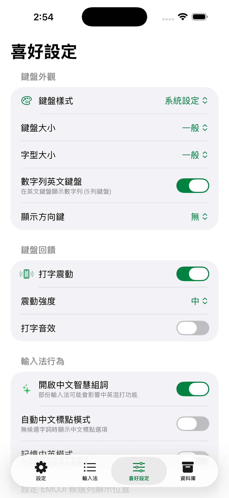 |  |
| 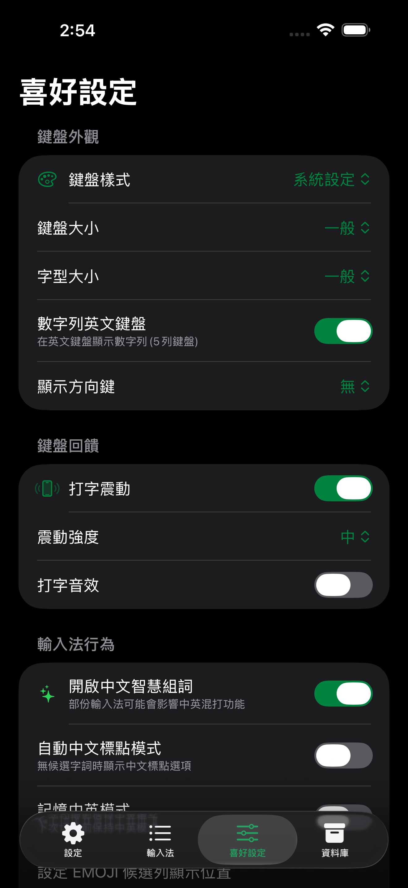 | 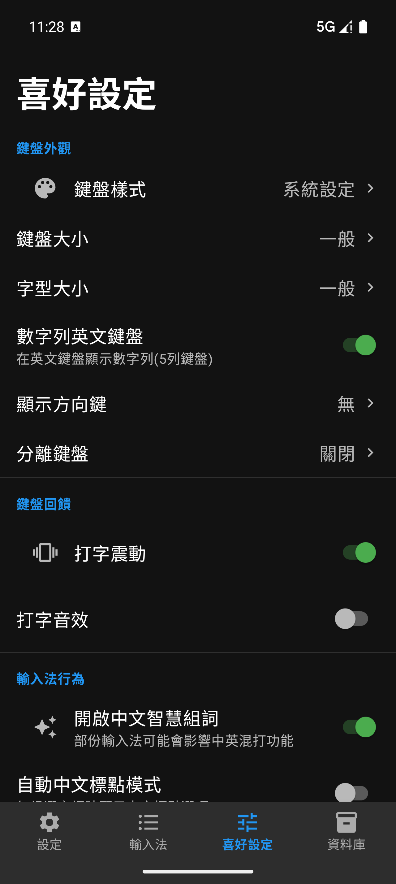 |

| iPad (light) | iPad (dark) |
|---|---|
| 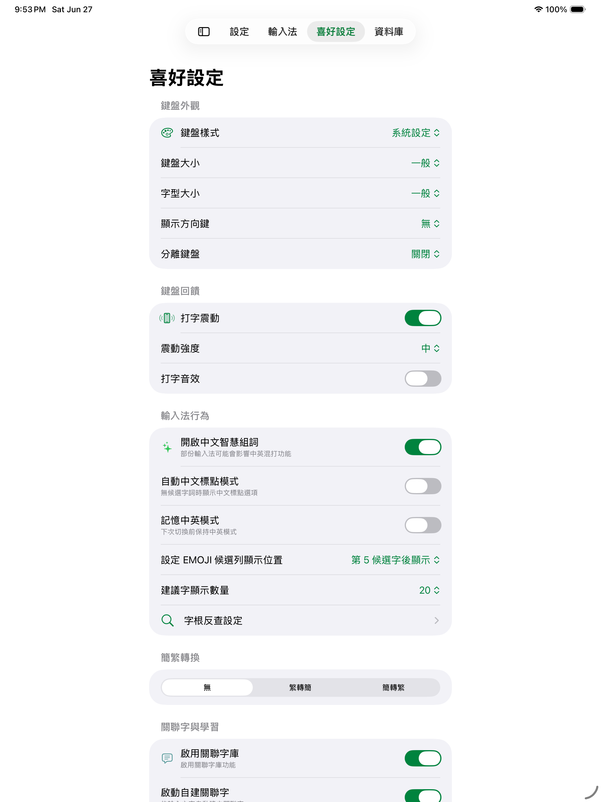 | 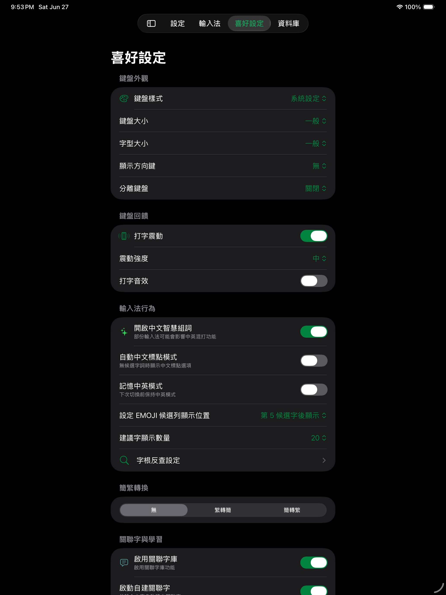 |

Use `@AppStorage(key, store: UserDefaults(suiteName: "group.org.limeime"))` (aliased as `sharedDefaults` constant) for every value.

### 8.1 Section 鍵盤外觀 (Keyboard Appearance)

| UI Control | Pref Key | Type | Default | Values / Notes |
|---|---|---|---|---|
| `Picker` "鍵盤樣式" | `keyboard_theme` | Int | 6 | 0=淺色 1=深色 2=粉紅 3=科技藍 4=時尚紫 5=放鬆綠 6=系統設定 |
| `Picker` "鍵盤大小" | `keyboard_size` | String | "1" | "1.2"=特大 "1.1"=大 "1"=一般 "0.9"=小 "0.8"=特小 |
| `Picker` "字型大小" | `font_size` | String | "1" | 特大/大/一般/小/特小 (same scale values as `keyboard_size`; the derived `candidateFontSize` Double is separate, see §9) |
| `Toggle` "數字列英文鍵盤" | `number_row_in_english` | Bool | true | 在英文鍵盤顯示數字列(5列鍵盤); **iPhone only** — hidden on iPad (`PreferencesTabView.swift` gates with `userInterfaceIdiom != .pad`) |
| `Picker` "顯示方向鍵" | `show_arrow_key` | Int | 0 | 0=無 1=軟鍵盤上方 2=軟鍵盤下方 |
| `Picker` "分離鍵盤" | `split_keyboard_mode` | Int | 0 | 0=關閉 1=開啟 2=僅橫向開啟; **iPad only** — hidden on iPhone |

> The keyboard extension reads `keyboard_theme` at `viewDidLoad`.
> - Values **0–5**: fixed colour themes regardless of system appearance. 0=淺色, 1=深色, 2=粉紅, 3=科技藍, 4=時尚紫, 5=放鬆綠.
> - Value **6**: follows the system Light/Dark appearance (`UITraitCollection.current.userInterfaceStyle` on iOS; `Configuration.UI_MODE_NIGHT_MASK` on Android). When the system switches between light and dark the keyboard re-renders accordingly.

### 8.2 Section 鍵盤回饋 (Keyboard Feedback)

| UI Control | Pref Key | Type | Default | Values / Notes |
|---|---|---|---|---|
| `Toggle` "打字震動" | `vibrate_on_keypress` | Bool | true | |
| `Picker` "震動強度" | `vibrate_level` | Int | 40 | 10=特弱 20=弱 40=中 60=強 80=特強; maps to `UIImpactFeedbackGenerator`: 10–20→`.light`, 40→`.medium`, 60–80→`.heavy` |
| `Toggle` "打字音效" | `sound_on_keypress` | Bool | false | |
| `Picker` "打字音量" | `keypress_sound_volume` | String | "-1" | "-1"=系統預設; "0.10"/"0.25"/"0.50"/"0.75"/"1.00"=LIME-owned click volume; disabled unless `sound_on_keypress` |

> Unlike Android API 31+ (which hides `vibrate_level`), iOS must keep this Picker because `UIImpactFeedbackGenerator` intensity is caller-controlled.

### 8.4 Section 輸入法行為 (IM Behaviour)

| UI Control | Pref Key | Type | Default | Values / Notes |
|---|---|---|---|---|
| `Toggle` "開啟中文智慧組詞" | `smart_chinese_input` | Bool | true | 部份輸入法可能會影響中英混打功能. |
| `Toggle` "自動中文標點模式" | `auto_chinese_symbol` | Bool | false | 無候選字詞時顯示中文標點選項. |
| `Toggle` "記憶中英模式" | `persistent_language_mode` | Bool | false | 下次切換前保持中英模式. |
| `Picker` "設定 EMOJI 候選列顯示位置" | `enable_emoji_position` | Int | 5 | 0=不顯示 Emoji 候選字; 2–10=第 N 候選字後顯示 |
| `Picker` "建議字顯示數量" | `similiar_list` | Int | 20 | Options 0 / 10 / 20 / 30 / 40 / 50; disabled unless `similiar_enable` (whose toggle lives in §8.6) |
| `NavigationLink` "字根反查設定" | `reverse_lookup_screen` | Screen | n/a | Opens §8.4.1. Last item in §8.4. |

> `candidate_switch` is declared (`@AppStorage`) but **bound to no UI control** — free-scroll candidate selection is now always on, so the old "滑動選取候選字" toggle was removed.

#### 8.4.1 字根反查設定 — Sub-screen

A `NavigationLink` "字根反查設定" appears as the last row inside §8.4 and opens a dedicated sub-screen. Configures which IM provides the reverse-lookup annotation for each main IM when no candidate is found. The `none` option disables the popup for that IM.

| iOS | Android |
|---|---|
|  |  |
| 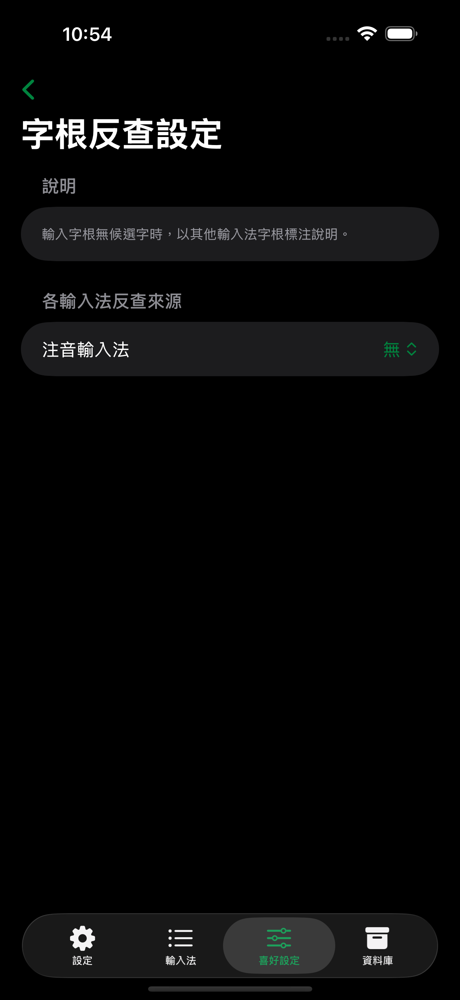 | 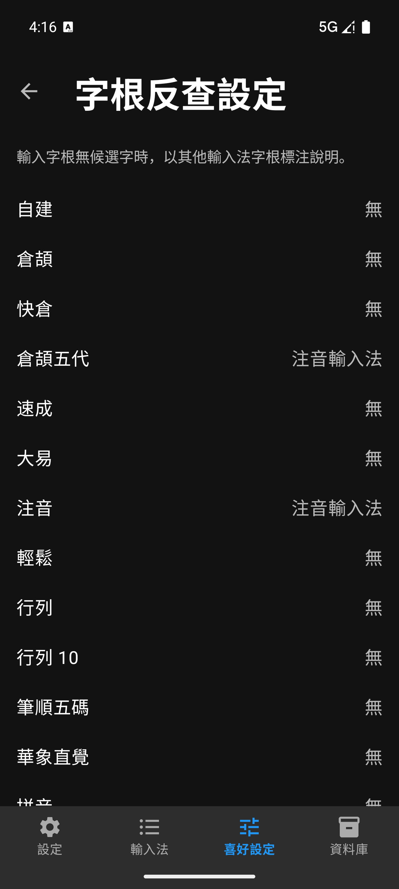 |

| iPad (light) | iPad (dark) |
|---|---|
| 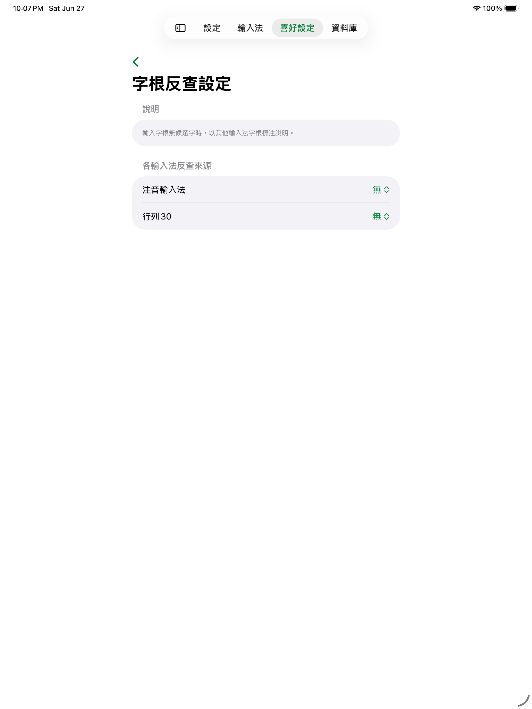 | 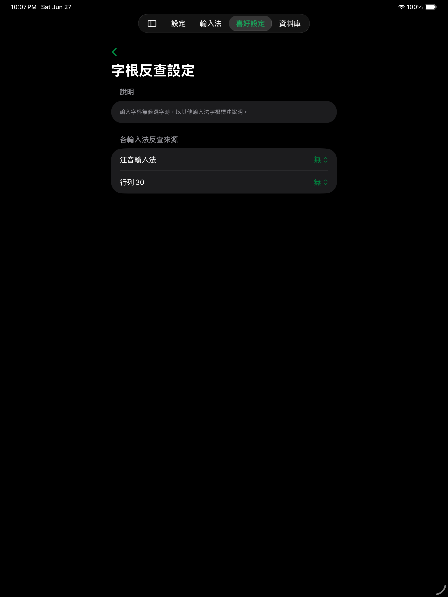 |

```
NavigationLink "字根反查設定" → ReverseLookupSettingsView
```

```
ReverseLookupSettingsView
└── Form
    ├── Section "說明"
    │   └── Text "輸入字根無候選字時，以其他輸入法字根標注說明。"
    └── Section "各輸入法反查來源"
        └── ForEach enabled IMs from the IM list tab path
            └── Picker "<IM list display name>" pref: <table>_im_reverselookup style: .menu
```

All pickers default to `"none"`. Picker rows are dynamic: iOS loads the same enabled IM list used by the IM list tab (`ManageImController.loadIMList()`), preserving that tab's order and display-name fallback. Picker choices are also dynamic: `none` displays as `無`, followed by the same enabled IM display names. Picker tags / stored values remain the table codes (`cj`, `phonetic`, `dayi`, etc.), so existing preferences and reverse-lookup DB logic remain compatible. If the source-choice list is unavailable, the picker choices may fall back to the built-in IM code list, but the visible rows do not fall back to all IMs.

### 8.5 Section 簡繁轉換 (Han Conversion)

| UI Control | Pref Key | Type | Default | Notes |
|---|---|---|---|---|
| `Picker` "中文簡/繁體字碼轉換" (`.segmented`) | `han_convert_option` | Int | 0 | 無 / 繁轉簡 / 簡轉繁 (0 / 1 / 2) |

iOS uses a `.segmented` `Picker`. Android renders an inline M3 segmented control (無 / 繁轉簡 / 簡轉繁) via `SegmentedHanPreference` (`preference_han_segmented.xml`), persisting the same `han_convert_option` String. The Android **keyboard extension** exposes the *same* segmented control inline at the top level of its long-press options menu — alongside an inline **分離鍵盤** segmented control (`split_keyboard`) — and applies both on dismiss (see the revision note "Long-press keyboard-key options menu"); all write the same keys as the Settings app.

At the maximum accessibility sizes (font scale 2.0 + largest display), three side-by-side segments can't fit the Chinese labels. `SegmentedHanPreference.stackIfClipped()` runs after layout and, if any segment's label is ellipsized, flips the `MaterialButtonToggleGroup` to **vertical** (full-width buttons) so every label shows in full — horizontal at normal sizes, a 3-row stack only when needed. Labels are 無 / 繁→簡 / 簡→繁. Same helper is reused by the keyboard long-press menu's 簡繁轉換 and 分離鍵盤 controls.

### 8.6 Section 關聯字與學習 (Related Phrases & Learning)

| UI Control | Pref Key | Type | Default | Notes |
|---|---|---|---|---|
| `Toggle` "啟用關聯字庫" | `similiar_enable` | Bool | true | 啟用關聯字庫功能 (gates the 建議字顯示數量 picker rendered in §8.4) |
| `Toggle` "啟動自建關聯字" | `candidate_suggestion` | Bool | true | 依輸入文字自動建立關聯字 |
| `Toggle` "自動學習新詞" | `learn_phrase` | Bool | true | 從常用關聯字學習新詞 |
| `Toggle` "啟動選取排序" | `learning_switch` | Bool | true | 依選取次數排序選字清單 |

### 8.7 Section 英文鍵盤 (English Keyboard)

| UI Control | Pref Key | Type | Default | Notes |
|---|---|---|---|---|
| `Toggle` "啟用英文字典" | `english_dictionary_enable` | Bool | true | 當使用英文輸入模式時，顯示英文建議字 |
| `Toggle` "首字自動大寫" | `auto_cap` | Bool | true | 在英文模式下，句首字母自動轉為大寫 |

> `accept_number_index` and `accept_symbol_index` are surfaced in §5.2 `IMDetailView` under the "字根對應設定" section, shown only when the custom IM is active (`im.tableNick == "custom"`). They are omitted from §8 because all built-in IMs hardcode their own number/symbol mapping behaviour.

> `auto_commit` is surfaced in §5.2 `IMDetailView` under the "電話鍵盤設定" section, shown only when `im.tableNick == "array10"`. It is IM-specific because it only applies to array10's phone-numpad keyboard layout. Android incorrectly also fires for phonetic (substring match bug); iOS uses `activeIM == "array10"` (correct intent).

---

## 9. Preference Key Reference

All stored in `UserDefaults(suiteName: "group.org.limeime")`.

| Pref Key | Android Key | Type | Default |
|---|---|---|---|
| `keyboard_theme` | `keyboard_theme` | Int | 6 |
| `enable_emoji_position` | `enable_emoji_position` | Int | 5 |
| `keyboard_size` | `keyboard_size` | String | "1" |
| `font_size` | `font_size` | String | "1" |
| `candidateFontSize` | *(derived)* | Double | 18 |
| `show_arrow_key` | `show_arrow_key` | Int | 0 |
| `split_keyboard_mode` | `split_keyboard_mode` | Int | 0 |
| `vibrate_on_keypress` | `vibrate_on_keypress` | Bool | true |
| `vibrate_level` | `vibrate_level` | Int | 40 |
| `sound_on_keypress` | `sound_on_keypress` | Bool | false |
| `keypress_sound_volume` | `keypress_sound_volume` | String | "-1" |
| `number_row_in_english` | `number_row_in_english` | Bool | true |
| `smart_chinese_input` | `smart_chinese_input` | Bool | true |
| `auto_chinese_symbol` | `auto_chinese_symbol` | Bool | false |
| `auto_commit` | `auto_commit` | Int | 0 *(array10 IMDetailView only)* |
| `phonetic_keyboard_type` | `phonetic_keyboard_type` | String | "standard" |
| `han_convert_option` | `han_convert_option` | Int | 0 |
| `custom_im_reverselookup` | `custom_im_reverselookup` | String | "none" |
| `cj_im_reverselookup` | `cj_im_reverselookup` | String | "none" |
| `scj_im_reverselookup` | `scj_im_reverselookup` | String | "none" |
| `cj5_im_reverselookup` | `cj5_im_reverselookup` | String | "none" |
| `ecj_im_reverselookup` | `ecj_im_reverselookup` | String | "none" |
| `dayi_im_reverselookup` | `dayi_im_reverselookup` | String | "none" |
| `phonetic_im_reverselookup` | `bpmf_im_reverselookup` | String | "none" *(iOS uses `phonetic_im_reverselookup` for the 注音 IM; `bpmf_im_reverselookup` is the legacy Android key, kept only by the backup adapter for parity)* |
| `ez_im_reverselookup` | `ez_im_reverselookup` | String | "none" |
| `array_im_reverselookup` | `array_im_reverselookup` | String | "none" |
| `array10_im_reverselookup` | `array10_im_reverselookup` | String | "none" |
| `wb_im_reverselookup` | `wb_im_reverselookup` | String | "none" |
| `hs_im_reverselookup` | `hs_im_reverselookup` | String | "none" |
| `pinyin_im_reverselookup` | `pinyin_im_reverselookup` | String | "none" |
| `similiar_list` | `similiar_list` | Int | 20 |
| `similiar_enable` | `similiar_enable` | Bool | true |
| `candidate_switch` | `candidate_switch` | Bool | true *(no UI — free-scroll always on; see §8.4)* |
| `candidate_suggestion` | `candidate_suggestion` | Bool | true |
| `learn_phrase` | `learn_phrase` | Bool | true |
| `learning_switch` | `learning_switch` | Bool | true |
| `english_dictionary_enable` | `english_dictionary_enable` | Bool | true |
| `accept_number_index` | `accept_number_index` | Bool | false |
| `accept_symbol_index` | `accept_symbol_index` | Bool | false |
| `persistent_language_mode` | `persistent_language_mode` | Bool | false |
| `keyboard_state` | `keyboard_state` | String | "" *(empty until built dynamically by `syncIMActivatedState`; semicolon-delimited enabled-IM indices)* |
| `keyboard_list` (active IM) | `keyboard_list` | String | "phonetic" |
| `language_mode` | `language_mode` | String | `"no"` *(internal storage state; "yes"=English-only, "no"=Chinese; written by `setLanguageMode` when `persistent_language_mode` is on; not user-toggleable)* |
| `auto_cap` | `auto_cap` | Bool | `true` *(surfaced as the 首字自動大寫 toggle in §8.7 英文鍵盤; in English mode, capitalises the first letter of a sentence)* |

**Per-IM backup/restore preference keys** (stored in `UserDefaults.standard`, NOT the App Group — keyboard extension does not read them):

| Pref Key | Android Key | Type | Default | Notes |
|---|---|---|---|---|
| `backup_on_delete_{tableNick}` | *(new)* | Bool | `true` | Per-IM. Controls whether learned records are backed up before `clearTable`. Shown in IMDetailView §5.2. |
| `restore_on_import_{tableNick}` | *(new)* | Bool | `true` | Per-IM. Controls whether backed-up records are restored after import/download. Shown in IMInstallView §5.3. |

---

## 10. iOS Adaptation Notes

### 10.1 Features Not Applicable on iOS

| Android Feature | Reason | iOS Decision |
|---|---|---|
| Entire 外接鍵盤 (External Keyboard) section | iOS does not allow 3rd-party keyboard extensions to intercept physical/Bluetooth keyboard input | **Omit entire section** |
| Google Drive backup | Not available on iOS | **Omit**; use Files / iCloud Drive via the iOS share sheet instead |
| `vibrate_level` hidden on Android API 31+ | iOS `UIImpactFeedbackGenerator` is caller-controlled | **Keep as Picker** with intensity mapping |
| System notification bar during DB load | Keyboard extensions cannot post system notifications | **Use in-app `ProgressView` overlay** |
| Android navigation drawer | Platform-specific pattern | **Use `TabView`** + `NavigationStack` |
| `BroadcastReceiver` for IME change | iOS has no equivalent broadcast | **Poll in `scenePhase` `.active` transition** |

### 10.2 iOS-Only Enhancements

| Feature | Notes |
|---|---|
| Three-state status banner | Real-time green / orange / red detection on scene activation |
| Split keyboard (iPad-only) | `split_keyboard_mode` row hidden on `UIDevice.current.userInterfaceIdiom == .phone` |
| Share-sheet backup | `UIActivityViewController` bridge (`ShareSheet`) for `.limedb` output |
| `@AppStorage(store:)` | Shared suite ensures keyboard extension reads prefs without IPC |
| `UIImpactFeedbackGenerator` | Maps `vibrate_level` → `.light / .medium / .heavy` style |

### 10.3 Shared UserDefaults

- **Always** use `UserDefaults(suiteName: "group.org.limeime")` — never `UserDefaults.standard`.
- **Never** use `@AppStorage` without the explicit `store:` parameter.
- Preferences are **not** synced via iCloud (`NSUbiquitousKeyValueStore`); that is a future opt-in.

**Exception — LimeSettings-only keys**: `backup_on_delete_{tableNick}` and `restore_on_import_{tableNick}` intentionally use `UserDefaults.standard` (not the App Group suite). These are UI-only preferences read exclusively by LimeSettings; the keyboard extension never reads them. Using `UserDefaults.standard` avoids polluting the shared App Group namespace with host-app-only state.

### 10.4 `keyboard_state` Synchronisation

Android stores enabled IM indices as a semicolon-delimited string (`"0;1;2;…"`). On iOS the canonical state is `im.enabled` in the DB, but `keyboard_state` must still be written whenever the user toggles an IM so `KeyboardViewController` can read it the same way. Port `LIMEPreferenceManager.syncIMActivatedState()` to call from the IM list toggle handler.

---

## 11. Data Persistence and Threading

### 11.1 Database Access

- All DB reads and writes must run on a **background thread** (`DispatchQueue.global(qos: .userInitiated)` or `Task { await … }` with an actor).
- All UI state mutations must occur on the **main thread** (`DispatchQueue.main.async` or `@MainActor`).

### 11.2 DB Open Guard

Every database-touching function should guard on a successful open:

```swift
guard let db = openDB() else {
    errorMessage = "無法開啟資料庫"
    return
}
```

### 11.3 Pagination Constants

| Constant | Value | Used in |
|---|---|---|
| Records per page | 100 | RecordListView (§6.1), RelatedListView (§6.2) |
| `similiar_list` default | 20 | Related-word candidate count (§8.6) |
| `similiar_list` options | 0 / 10 / 20 / 30 / 40 / 50 | Picker in §8.6 |

---

## 12. Feature Parity Checklist

### App Setup (§4)
- [x] Step-by-step keyboard activation guide
- [x] Real-time keyboard-enabled status banner (green / orange / red)
- [x] Full Access detection
- [x] "前往系統設定" deep-link button
- [ ] Optional `RECORD_AUDIO` setup step for LIME inline dictation — Android-only; not part of the iOS setup tab
- [ ] Bundled IM seeding — *not ported*: the iOS app has no `seedDefaultIMs`; IMs are installed only via the download / import flow (§5.3)
- [x] App version, licence, GitHub link
- [ ] Rating prompt card (§4.4) — **iOS implemented** (`SetupTabView.swift`, App Store write-review deep link + ×/confirm dismiss); **Android pending** (Google Play listing)

### IM Manager — IM List (§5.1)
- [x] List of installed IMs with enable/disable toggle
- [x] Toggle persists to `im.enabled` and updates `keyboard_state` preference
- [ ] Drag-to-reorder persists to `im.sortOrder` — *removed* in the 4-tab re-layout; the list is not reorderable and add is the `+` FAB (§5.1)
- [x] Enabled / disabled visual distinction (full / half opacity)

### IM Manager — IM Detail & Soft Keyboard (§5.2)
- [x] IM info: source, version, record count, status
- [x] Keyboard layout picker (`KeyboardPickerView`)
- [x] `phonetic_keyboard_type` live update on keyboard change
- [x] "字根對應設定" section with `accept_number_index` / `accept_symbol_index` toggles (shown only when `im.tableNick == "custom"`) — **§13.3 done**

### IM Manager — Download & Import (§5.3)
- [x] Per-IM `DisclosureGroup` list: 注音, 倉頡, 快倉, 倉頡五代, 速成, 大易, 輕鬆, 行列, 行列 10, 拼音, 華象直覺, 筆順五碼, 自建
- [x] Cloud download buttons (☁) for each built-in IM; none for 自建
- [x] `Button "匯入 .limedb"` + `Button "匯入 .cin / .lime"` for every IM row; all named-IM rows use fixed `tableName`
- [x] Each DisclosureGroup contains cloud variant rows + `Button "匯入 .limedb"` + `Button "匯入 .cin / .lime"` with fixed `tableName = family.id` — **§13.3 done**
- [x] 自建 group (no cloud variants) appended to catalog; import calls `seedCustomIM()` after — **§13.3 done**
- [x] Progress overlay during import / download
- [x] Status message on completion

### IM Table Editor — Mapping Records (§6.1)
- [x] Paginated record list (100/page) with pagination bar
- [x] Search by code (prefix)
- [x] Search by word (contains)
- [x] Add record (code + word + score stepper)
- [x] Edit record (code, word, +/- score)
- [x] Delete record (swipe action + confirmation)

### IM Table Editor — Related Phrases (§6.2)
- [x] Paginated related-phrase list (100/page)
- [x] Search by word
- [x] Add related phrase (word → related)
- [x] Edit related phrase
- [x] Delete related phrase (swipe + confirmation)

### DB Manager (§7)
- [x] Backup database via share sheet (Files, AirDrop, …)
- [x] Restore database from file picker (with confirmation alert)
- [x] Progress overlay during backup / restore

### IM Preferences (§8)
- **Keyboard Appearance** (§8.1): `keyboard_theme` (values 0–5 + **6=系統設定** on both platforms — **§13.2 done**), `keyboard_size`, `font_size`, `number_row_in_english` (iPhone-only), `show_arrow_key`, `split_keyboard_mode` (iPad)
- **Feedback** (§8.2): `vibrate_on_keypress`, `vibrate_level`, `sound_on_keypress`, `keypress_sound_volume`
- **IM Behaviour** (§8.4): `smart_chinese_input`, `auto_chinese_symbol`, `enable_emoji_position`, `similiar_list` (建議字顯示數量), `reverse_lookup_screen` (`candidate_switch` is declared but has **no UI** — free-scroll candidate selection is always on)
- **Array10 detail page** (§5.2): `auto_commit`
- **Phonetic IM detail page** (§5.2.2): `phonetic_keyboard_type` (6 options) with live IM table update
- **Han Conversion** (§8.5): `han_convert_option`
- **Learning** (§8.6): `similiar_enable`, `similiar_list`, `candidate_suggestion`, `learn_phrase`, `learning_switch`
- **English Dictionary** (§8.7): `english_dictionary_enable`
- ~~**External Keyboard**: removed — iOS does not allow 3rd-party extensions to intercept physical keyboard input~~ — **§13.1 done**
- **Reverse Lookup sub-screen** (§8.4.1): Drill-in from §8.4 with per-IM picker rows; each picker shows `無` plus the enabled IM display names while storing table-code values.

---

## 13. Completed work

All three items previously tracked here have shipped; they are kept as a short record (details live in the referenced sections).

### 13.1 Remove Physical Keyboard Dead Code — ✅ done

Physical/Bluetooth-keyboard preferences and their tests were removed from `PreferencesTabView.swift`, `LIMEPreferenceManager.swift`, and the test suite. No "外接鍵盤" section or physical-keyboard pref keys remain.

### 13.2 `keyboard_theme` Value 6 (系統設定) — ✅ done

Implemented: the §8.1 picker offers `6=系統設定` (now the default); `KeyboardViewController` resolves `6` → light/dark from `userInterfaceStyle` and re-applies on appearance change (`traitCollectionDidChange`); `testKeyboardThemeSystemValue()` covers default + round-trip.

### 13.3 Custom IM (自建輸入法) Support — ✅ done

Implemented: the `自建` family (import-only, no cloud variants) in `IMCatalog`; `seedCustomIM()` in `LimeDB`/`DBServer` called after a custom import (§5.3); and the "字根對應設定" section (`數字字根對應` / `符號字根對應`, keys `accept_number_index` / `accept_symbol_index`) shown only when `im.tableNick == "custom"` in `IMDetailView` (§5.2).

## 14. Revision history

### 4-tab top-page re-layout (2026-06)

The four top-level tabs (設定 · 輸入法 · 喜好設定 · 資料庫) were re-laid-out to bring iOS and
Android as visually close as possible. The full deltas are folded into the sections above; in brief:

- **Visual system.** Dropped the multi-colour icon tiles for a single neutral-grey rounded-square
  badge holding each IM's representative glyph (注音→ㄅ, 大易→易, 倉頡-family→倉, 行列10→10, else first
  char); accent colour reserved for interactive controls. iOS uses the fixed LIME brand green
  (`#00833E`); Android inherits the system Material You palette (Dynamic Colors +
  `MODE_NIGHT_FOLLOW_SYSTEM`, no in-app theme picker). Type scale aligned to the iOS sizes.
- **設定 tab.** Setup hero is a horizontal logo-beside-wordmark row; the About block is three tonal
  link chips (使用手冊 / 版權說明 / 原始碼) over a one-line copyright banner, with 使用手冊 / 版權說明
  opening in an in-app browser. Added the §4.3 installed-IM status block.
- **輸入法 tab.** IM list is name-only and non-reorderable, with a round `+` FAB and an empty-state
  nudge; Android tablet uses a NavigationRail + two-pane layout. IM detail's 移除輸入法 is a bordered
  destructive button; Android export offers 分享 / 本機儲存 in `.lime` / `.limedb`.
- **喜好設定 tab.** Second-level rows show their current value inline + chevron; 簡繁轉換 is an inline
  segmented control that stacks vertically when labels clip at large fonts; section-leading rows carry
  tinted icons.
- **資料庫 tab.** Unified three-section layout; 還原預設資料庫 carries a red irreversible-action warning;
  tonal buttons use a dark-mode-legible fill.
- **Keyboard extension.** The long-press options menu was restyled to match 喜好設定 (icons + inline
  segmented 簡繁轉換 / 分離鍵盤) on both platforms; the menu title is now 萊姆輸入法.
